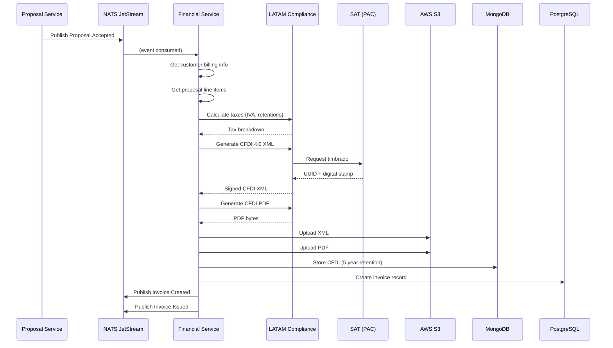
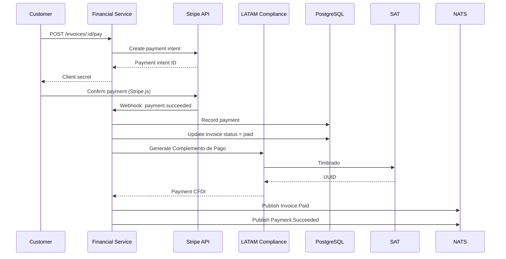

# Financial Service - Diseño de Solución Detallado
**Version**: 1.0.0 | **Fecha**: Enero 2025 | **Status**: Design Complete ✅

---

## 🎯 Visión General

### Bounded Context
**Financial Management & LATAM Billing** - Gestión completa de facturación CFDI (México), pagos, impuestos y contabilidad para LATAM.

### Responsabilidades Core
```yaml
Primary:
  - CFDI 4.0 invoice generation (México SAT)
  - Payment processing (Stripe, PayPal, bank transfers)
  - Tax calculation (IVA, retentions, LATAM-specific)
  - Revenue recognition (ASC 606 compliant)
  - Subscription billing (recurring)
  - Payment plans & installments
  - Credit notes & refunds (CFDI Egreso)
  - Currency exchange rate management
  - Accounting export (QuickBooks, Xero integration)

Secondary:
  - Payment reminders
  - Dunning management (failed payments)
  - Revenue reporting
  - Tax reporting
  - Collections management
```

### Dependencies
```yaml
Upstream:
  - Proposal Service: Accepted proposals → Invoices
  - Customer Service: Customer billing info
  - LATAM Compliance Service: CFDI generation, SAT validation

Downstream:
  - Analytics Service: Revenue metrics
  - Notification Service: Payment notifications

External:
  - Stripe API (payment processing)
  - PayPal API
  - SAT API (México tax authority)
  - Exchange rate API (Banxico)

Infrastructure:
  - PostgreSQL: Transactional financial data
  - MongoDB: CFDI XML storage (5 year retention)
  - S3: CFDI PDFs, financial documents
  - NATS: Event publishing
```

---

## 📊 Casos de Uso Principales

### UC-1: Generate CFDI Invoice from Accepted Proposal
```yaml
Trigger: Proposal.Accepted event
Flow:
  1. System receives Proposal.Accepted event
  2. System gets customer billing info
  3. System gets proposal line items
  4. System calculates IVA, retentions (LATAM Compliance Service)
  5. System generates CFDI 4.0 XML (PAC timbrado)
  6. System generates PDF invoice
  7. System stores XML/PDF (MongoDB + S3, 5 year retention)
  8. System creates Invoice record (PostgreSQL)
  9. System publishes Invoice.Created event
  10. System sends invoice to customer (email)

Business Rules:
  - CFDI must comply with SAT regulations
  - Automatic numbering (Serie-Folio)
  - Digital signature (CSD)
  - PAC timbrado required
```

### UC-2: Process Payment
```yaml
Actor: Customer (online), Admin (manual)
Payment Methods:
  - Credit card (Stripe)
  - Bank transfer (SPEI México)
  - PayPal

Flow:
  1. Customer selects payment method
  2. System creates payment intent (Stripe)
  3. Customer completes payment
  4. Stripe webhook: payment.succeeded
  5. System records payment
  6. System marks invoice as Paid
  7. System generates Complemento de Pago (CFDI payment receipt)
  8. System publishes Invoice.Paid event
  9. System sends payment confirmation

Payment Reconciliation:
  - Daily job matches bank transfers to invoices
  - Manual reconciliation for unclear payments
```

### UC-3: Subscription Billing
```yaml
Actor: System (automated)
Trigger: Daily cron job
Flow:
  1. System identifies subscriptions due for billing
  2. For each subscription:
     a. System gets contract details
     b. System calculates prorated amount (if applicable)
     c. System generates CFDI invoice
     d. System attempts payment (Stripe subscription)
     e. If success → Mark paid
     f. If failure → Start dunning workflow
  3. System publishes Subscription.Billed event

Dunning Workflow (failed payment):
  - Day 1: Retry payment
  - Day 3: Email reminder + retry
  - Day 7: Email warning + retry
  - Day 14: Suspend service
  - Day 30: Cancel subscription
```

### UC-4: Credit Note (CFDI Egreso)
```yaml
Actor: Admin, System
Use Cases:
  - Invoice error correction
  - Partial/full refund
  - Cancellation

Flow:
  1. Admin initiates credit note
  2. System validates original invoice
  3. System generates CFDI Egreso (type: E)
  4. System relates to original CFDI (UUID)
  5. System generates PAC timbrado
  6. System stores XML/PDF
  7. System updates invoice status: Credited
  8. System processes refund (if applicable)
  9. System publishes CreditNote.Created event
```

---

## 🏛️ Arquitectura de Dominio (DDD)

### Aggregate: Invoice

```typescript
/**
 * Invoice Aggregate (CFDI-compliant)
 */

enum InvoiceStatus {
  DRAFT = 'draft',
  ISSUED = 'issued',        // Timbrado SAT
  PAID = 'paid',
  PARTIALLY_PAID = 'partially_paid',
  OVERDUE = 'overdue',
  CANCELLED = 'cancelled',   // Cancelado SAT
  CREDITED = 'credited',     // Has credit note
}

enum PaymentMethod {
  CREDIT_CARD = 'credit_card',
  BANK_TRANSFER = 'bank_transfer',
  PAYPAL = 'paypal',
  CASH = 'cash',
  CHECK = 'check',
}

class Money {
  constructor(
    public readonly amount: number,
    public readonly currency: 'MXN' | 'USD' | 'EUR'
  ) {}

  add(other: Money): Money {
    if (this.currency !== other.currency) {
      throw new Error('Currency mismatch');
    }
    return new Money(this.amount + other.amount, this.currency);
  }

  format(): string {
    return new Intl.NumberFormat('es-MX', {
      style: 'currency',
      currency: this.currency,
    }).format(this.amount);
  }
}

class CFDIData {
  constructor(
    public readonly uuid: string,              // Folio fiscal SAT
    public readonly serie: string,             // Serie
    public readonly folio: string,             // Folio
    public readonly cfdiXmlUrl: string,        // S3 URL
    public readonly cfdiPdfUrl: string,        // S3 URL
    public readonly satCertNumber: string,     // Certificado SAT
    public readonly rfcEmisor: string,         // RFC empresa
    public readonly rfcReceptor: string,       // RFC cliente
    public readonly timbradoAt: Date,          // Fecha timbrado
    public readonly cancelledAt: Date | null   // Fecha cancelación SAT
  ) {}
}

class LineItem {
  constructor(
    public readonly id: string,
    public readonly productId: string,
    public readonly description: string,
    public readonly quantity: number,
    public readonly unitPrice: Money,
    public readonly subtotal: Money,
    public readonly taxAmount: Money,
    public readonly total: Money,
    public readonly claveProdServ: string,      // SAT product key
    public readonly claveUnidad: string         // SAT unit key
  ) {}
}

class Invoice {
  private domainEvents: DomainEvent[] = [];

  constructor(
    public readonly id: string,
    public readonly tenantId: string,
    public readonly invoiceNumber: string,     // Serie-Folio
    public readonly customerId: string,
    public readonly proposalId: string | null,
    private status: InvoiceStatus,
    private lineItems: LineItem[],
    private subtotal: Money,
    private taxAmount: Money,              // IVA
    private retentionAmount: Money,        // Retenciones
    private total: Money,
    private cfdiData: CFDIData | null,
    private dueDate: Date,
    private paidAt: Date | null,
    private paidAmount: Money,
    private paymentMethod: PaymentMethod | null,
    public readonly createdAt: Date,
    private updatedAt: Date
  ) {}

  // Business logic
  issue(cfdiData: CFDIData): Result<void> {
    if (this.status !== InvoiceStatus.DRAFT) {
      return Result.fail('Only draft invoices can be issued');
    }

    this.cfdiData = cfdiData;
    this.status = InvoiceStatus.ISSUED;
    this.updatedAt = new Date();

    this.addDomainEvent({
      type: 'Invoice.Issued',
      data: {
        invoiceId: this.id,
        invoiceNumber: this.invoiceNumber,
        customerId: this.customerId,
        total: this.total.amount,
        uuid: cfdiData.uuid,
      },
    });

    return Result.ok();
  }

  recordPayment(amount: Money, method: PaymentMethod): Result<void> {
    if (this.status === InvoiceStatus.CANCELLED) {
      return Result.fail('Cannot pay cancelled invoice');
    }

    this.paidAmount = this.paidAmount.add(amount);
    this.paymentMethod = method;

    if (this.paidAmount.amount >= this.total.amount) {
      this.status = InvoiceStatus.PAID;
      this.paidAt = new Date();
    } else {
      this.status = InvoiceStatus.PARTIALLY_PAID;
    }

    this.updatedAt = new Date();

    this.addDomainEvent({
      type: 'Invoice.Paid',
      data: {
        invoiceId: this.id,
        amount: amount.amount,
        method,
        fullyPaid: this.status === InvoiceStatus.PAID,
      },
    });

    return Result.ok();
  }

  cancel(reason: string): Result<void> {
    if (this.status === InvoiceStatus.PAID) {
      return Result.fail('Cannot cancel paid invoice (use credit note)');
    }

    this.status = InvoiceStatus.CANCELLED;
    this.updatedAt = new Date();

    if (this.cfdiData) {
      this.cfdiData = new CFDIData(
        this.cfdiData.uuid,
        this.cfdiData.serie,
        this.cfdiData.folio,
        this.cfdiData.cfdiXmlUrl,
        this.cfdiData.cfdiPdfUrl,
        this.cfdiData.satCertNumber,
        this.cfdiData.rfcEmisor,
        this.cfdiData.rfcReceptor,
        this.cfdiData.timbradoAt,
        new Date() // Cancelled now
      );
    }

    this.addDomainEvent({
      type: 'Invoice.Cancelled',
      data: { invoiceId: this.id, reason },
    });

    return Result.ok();
  }

  markOverdue(): Result<void> {
    if (this.status === InvoiceStatus.ISSUED && this.dueDate < new Date()) {
      this.status = InvoiceStatus.OVERDUE;
      this.updatedAt = new Date();

      this.addDomainEvent({
        type: 'Invoice.Overdue',
        data: {
          invoiceId: this.id,
          customerId: this.customerId,
          daysOverdue: Math.ceil(
            (Date.now() - this.dueDate.getTime()) / (1000 * 60 * 60 * 24)
          ),
        },
      });

      return Result.ok();
    }

    return Result.fail('Invoice is not overdue');
  }

  // Getters
  getStatus(): InvoiceStatus { return this.status; }
  getTotal(): Money { return this.total; }
  getCFDI(): CFDIData | null { return this.cfdiData; }

  getDomainEvents(): DomainEvent[] { return [...this.domainEvents]; }
  clearDomainEvents(): void { this.domainEvents = []; }

  private addDomainEvent(event: any): void {
    this.domainEvents.push({
      id: crypto.randomUUID(),
      ...event,
      tenantId: this.tenantId,
      timestamp: new Date(),
    });
  }

  // Factory
  static createFromProposal(
    tenantId: string,
    invoiceNumber: string,
    customerId: string,
    proposalId: string,
    lineItems: LineItem[],
    subtotal: Money,
    taxAmount: Money,
    retentionAmount: Money,
    total: Money,
    dueDate: Date
  ): Result<Invoice> {
    const invoice = new Invoice(
      crypto.randomUUID(),
      tenantId,
      invoiceNumber,
      customerId,
      proposalId,
      InvoiceStatus.DRAFT,
      lineItems,
      subtotal,
      taxAmount,
      retentionAmount,
      total,
      null,
      dueDate,
      null,
      new Money(0, total.currency),
      null,
      new Date(),
      new Date()
    );

    invoice.addDomainEvent({
      type: 'Invoice.Created',
      data: {
        invoiceId: invoice.id,
        customerId,
        proposalId,
        total: total.amount,
      },
    });

    return Result.ok(invoice);
  }
}
```

### Aggregate: Payment

```typescript
/**
 * Payment Aggregate
 */

enum PaymentStatus {
  PENDING = 'pending',
  PROCESSING = 'processing',
  SUCCEEDED = 'succeeded',
  FAILED = 'failed',
  REFUNDED = 'refunded',
}

class Payment {
  private domainEvents: DomainEvent[] = [];

  constructor(
    public readonly id: string,
    public readonly tenantId: string,
    public readonly invoiceId: string,
    public readonly customerId: string,
    private amount: Money,
    private method: PaymentMethod,
    private status: PaymentStatus,
    private stripePaymentIntentId: string | null,
    private referenceNumber: string | null,  // Bank transfer reference
    private processedAt: Date | null,
    private failureReason: string | null,
    public readonly createdAt: Date
  ) {}

  markSucceeded(): Result<void> {
    if (this.status !== PaymentStatus.PROCESSING) {
      return Result.fail('Can only succeed processing payments');
    }

    this.status = PaymentStatus.SUCCEEDED;
    this.processedAt = new Date();

    this.addDomainEvent({
      type: 'Payment.Succeeded',
      data: {
        paymentId: this.id,
        invoiceId: this.invoiceId,
        amount: this.amount.amount,
        method: this.method,
      },
    });

    return Result.ok();
  }

  markFailed(reason: string): Result<void> {
    this.status = PaymentStatus.FAILED;
    this.failureReason = reason;
    this.processedAt = new Date();

    this.addDomainEvent({
      type: 'Payment.Failed',
      data: {
        paymentId: this.id,
        invoiceId: this.invoiceId,
        reason,
      },
    });

    return Result.ok();
  }

  refund(): Result<void> {
    if (this.status !== PaymentStatus.SUCCEEDED) {
      return Result.fail('Can only refund succeeded payments');
    }

    this.status = PaymentStatus.REFUNDED;

    this.addDomainEvent({
      type: 'Payment.Refunded',
      data: {
        paymentId: this.id,
        invoiceId: this.invoiceId,
        amount: this.amount.amount,
      },
    });

    return Result.ok();
  }

  getDomainEvents(): DomainEvent[] { return [...this.domainEvents]; }
  clearDomainEvents(): void { this.domainEvents = []; }
  private addDomainEvent(event: any): void {
    this.domainEvents.push({
      id: crypto.randomUUID(),
      ...event,
      tenantId: this.tenantId,
      timestamp: new Date(),
    });
  }

  static create(
    tenantId: string,
    invoiceId: string,
    customerId: string,
    amount: Money,
    method: PaymentMethod
  ): Result<Payment> {
    const payment = new Payment(
      crypto.randomUUID(),
      tenantId,
      invoiceId,
      customerId,
      amount,
      method,
      PaymentStatus.PENDING,
      null,
      null,
      null,
      null,
      new Date()
    );

    payment.addDomainEvent({
      type: 'Payment.Created',
      data: {
        paymentId: payment.id,
        invoiceId,
        amount: amount.amount,
        method,
      },
    });

    return Result.ok(payment);
  }
}
```

---

## 🗄️ Base de Datos

### PostgreSQL Schema (Resumido)

```sql
-- Invoices table
CREATE TABLE invoices (
  id UUID PRIMARY KEY DEFAULT gen_random_uuid(),
  tenant_id UUID NOT NULL,
  invoice_number VARCHAR(50) NOT NULL,      -- SERIE-FOLIO
  customer_id UUID NOT NULL,
  proposal_id UUID,

  status VARCHAR(50) NOT NULL DEFAULT 'draft',

  -- Amounts
  subtotal DECIMAL(15, 2) NOT NULL,
  tax_amount DECIMAL(15, 2) NOT NULL,       -- IVA
  retention_amount DECIMAL(15, 2) NOT NULL, -- Retenciones
  total DECIMAL(15, 2) NOT NULL,
  currency VARCHAR(3) NOT NULL DEFAULT 'MXN',

  -- CFDI data
  cfdi_uuid VARCHAR(36) UNIQUE,             -- Folio fiscal SAT
  cfdi_serie VARCHAR(10),
  cfdi_folio VARCHAR(20),
  cfdi_xml_url TEXT,
  cfdi_pdf_url TEXT,
  cfdi_timbrado_at TIMESTAMP,
  cfdi_cancelled_at TIMESTAMP,

  -- Payment
  due_date DATE NOT NULL,
  paid_at TIMESTAMP,
  paid_amount DECIMAL(15, 2) DEFAULT 0,
  payment_method VARCHAR(50),

  created_at TIMESTAMP DEFAULT NOW(),
  updated_at TIMESTAMP DEFAULT NOW(),

  CONSTRAINT fk_tenant FOREIGN KEY (tenant_id) REFERENCES tenants(id),
  CONSTRAINT unique_invoice_number UNIQUE (tenant_id, invoice_number),
  CONSTRAINT check_status CHECK (status IN (
    'draft', 'issued', 'paid', 'partially_paid', 'overdue', 'cancelled', 'credited'
  ))
);

CREATE INDEX idx_invoices_customer ON invoices(customer_id);
CREATE INDEX idx_invoices_status ON invoices(status);
CREATE INDEX idx_invoices_cfdi_uuid ON invoices(cfdi_uuid);
CREATE INDEX idx_invoices_due_date ON invoices(due_date);

-- Invoice line items
CREATE TABLE invoice_line_items (
  id UUID PRIMARY KEY DEFAULT gen_random_uuid(),
  invoice_id UUID NOT NULL,
  product_id UUID,

  description VARCHAR(500) NOT NULL,
  quantity DECIMAL(10, 2) NOT NULL,
  unit_price DECIMAL(15, 2) NOT NULL,

  subtotal DECIMAL(15, 2) NOT NULL,
  tax_amount DECIMAL(15, 2) NOT NULL,
  total DECIMAL(15, 2) NOT NULL,

  -- SAT keys (México)
  clave_prod_serv VARCHAR(10),  -- c_ClaveProdServ
  clave_unidad VARCHAR(10),     -- c_ClaveUnidad

  CONSTRAINT fk_invoice FOREIGN KEY (invoice_id) REFERENCES invoices(id) ON DELETE CASCADE
);

-- Payments table
CREATE TABLE payments (
  id UUID PRIMARY KEY DEFAULT gen_random_uuid(),
  tenant_id UUID NOT NULL,
  invoice_id UUID NOT NULL,
  customer_id UUID NOT NULL,

  amount DECIMAL(15, 2) NOT NULL,
  currency VARCHAR(3) NOT NULL,
  method VARCHAR(50) NOT NULL,
  status VARCHAR(50) NOT NULL DEFAULT 'pending',

  -- External references
  stripe_payment_intent_id VARCHAR(255),
  reference_number VARCHAR(100),        -- Bank transfer reference

  processed_at TIMESTAMP,
  failure_reason TEXT,

  created_at TIMESTAMP DEFAULT NOW(),

  CONSTRAINT fk_tenant FOREIGN KEY (tenant_id) REFERENCES tenants(id),
  CONSTRAINT fk_invoice FOREIGN KEY (invoice_id) REFERENCES invoices(id),
  CONSTRAINT check_status CHECK (status IN (
    'pending', 'processing', 'succeeded', 'failed', 'refunded'
  ))
);

CREATE INDEX idx_payments_invoice ON payments(invoice_id);
CREATE INDEX idx_payments_customer ON payments(customer_id);
CREATE INDEX idx_payments_stripe ON payments(stripe_payment_intent_id);

-- Credit notes table
CREATE TABLE credit_notes (
  id UUID PRIMARY KEY DEFAULT gen_random_uuid(),
  tenant_id UUID NOT NULL,
  credit_note_number VARCHAR(50) NOT NULL,
  original_invoice_id UUID NOT NULL,

  amount DECIMAL(15, 2) NOT NULL,
  currency VARCHAR(3) NOT NULL,
  reason TEXT,

  -- CFDI Egreso
  cfdi_uuid VARCHAR(36) UNIQUE,
  cfdi_xml_url TEXT,
  cfdi_pdf_url TEXT,

  created_at TIMESTAMP DEFAULT NOW(),

  CONSTRAINT fk_tenant FOREIGN KEY (tenant_id) REFERENCES tenants(id),
  CONSTRAINT fk_invoice FOREIGN KEY (original_invoice_id) REFERENCES invoices(id)
);

-- Subscriptions table
CREATE TABLE subscriptions (
  id UUID PRIMARY KEY DEFAULT gen_random_uuid(),
  tenant_id UUID NOT NULL,
  customer_id UUID NOT NULL,
  contract_id UUID NOT NULL,

  status VARCHAR(50) NOT NULL DEFAULT 'active',
  billing_interval VARCHAR(20) NOT NULL, -- monthly, quarterly, yearly

  amount DECIMAL(15, 2) NOT NULL,
  currency VARCHAR(3) NOT NULL,

  start_date DATE NOT NULL,
  end_date DATE,
  next_billing_date DATE NOT NULL,

  stripe_subscription_id VARCHAR(255),

  created_at TIMESTAMP DEFAULT NOW(),
  cancelled_at TIMESTAMP,

  CONSTRAINT fk_tenant FOREIGN KEY (tenant_id) REFERENCES tenants(id)
);
```

### MongoDB (CFDI Storage)

```typescript
// Collection: cfdi_documents
interface CFDIDocument {
  _id: ObjectId;
  tenant_id: string;
  invoice_id: string;
  cfdi_uuid: string;

  xml_content: string;      // Full CFDI XML
  xml_signed: string;       // Signed XML (with SAT stamp)

  type: 'ingreso' | 'egreso' | 'pago';  // I=Invoice, E=Credit, P=Payment

  sat_cert_number: string;
  timbrado_at: Date;
  cancelled_at: Date | null;

  // 5-year retention (SAT requirement)
  retention_until: Date;    // created_at + 5 years
  expires_at: Date;         // TTL index
}

db.cfdi_documents.createIndexes([
  { key: { tenant_id: 1, invoice_id: 1 } },
  { key: { cfdi_uuid: 1 }, unique: true },
  { key: { expires_at: 1 }, expireAfterSeconds: 0 },
]);
```

---

## 🔌 API Design (Resumido)

```typescript
/**
 * Financial Service - API v1
 */

// POST /api/v1/invoices/generate-from-proposal
interface GenerateInvoiceRequest {
  proposal_id: string;
  due_days?: number; // Default: 30
}

interface GenerateInvoiceResponse {
  invoice_id: string;
  invoice_number: string;
  cfdi_uuid: string;
  cfdi_pdf_url: string;
  total: number;
  due_date: string;
}

// POST /api/v1/invoices/:id/pay
interface PayInvoiceRequest {
  amount: number;
  method: 'credit_card' | 'bank_transfer' | 'paypal';
  payment_token?: string; // Stripe token
  reference_number?: string; // Bank transfer
}

// POST /api/v1/invoices/:id/credit-note
interface CreateCreditNoteRequest {
  amount: number;
  reason: string;
}

// POST /api/v1/payments/stripe-webhook
// Webhook receiver for Stripe events

// GET /api/v1/invoices
// List invoices (paginated)

// GET /api/v1/invoices/overdue
// Get overdue invoices

// GET /api/v1/revenue/summary
// Revenue analytics
```

---

## 🔄 Event-Driven Flows

### Flow: Proposal Accepted → Invoice Generation



### Flow: Payment Processing (Stripe)



---

## 💳 Stripe Integration

```typescript
/**
 * Stripe Payment Service
 */
import Stripe from 'stripe';

class StripePaymentService {
  private stripe: Stripe;

  constructor() {
    this.stripe = new Stripe(process.env.STRIPE_SECRET_KEY!, {
      apiVersion: '2023-10-16',
    });
  }

  async createPaymentIntent(
    invoice: Invoice,
    customerId: string
  ): Promise<Result<{ clientSecret: string; paymentIntentId: string }>> {
    try {
      const paymentIntent = await this.stripe.paymentIntents.create({
        amount: Math.round(invoice.getTotal().amount * 100), // Cents
        currency: invoice.getTotal().currency.toLowerCase(),
        customer: customerId, // Stripe customer ID
        metadata: {
          invoice_id: invoice.id,
          invoice_number: invoice.invoiceNumber,
        },
        automatic_payment_methods: {
          enabled: true,
        },
      });

      return Result.ok({
        clientSecret: paymentIntent.client_secret!,
        paymentIntentId: paymentIntent.id,
      });
    } catch (error) {
      return Result.fail(`Stripe error: ${error.message}`);
    }
  }

  async handleWebhook(payload: Buffer, signature: string): Promise<Result<void>> {
    try {
      const event = this.stripe.webhooks.constructEvent(
        payload,
        signature,
        process.env.STRIPE_WEBHOOK_SECRET!
      );

      switch (event.type) {
        case 'payment_intent.succeeded':
          await this.handlePaymentSucceeded(event.data.object);
          break;
        case 'payment_intent.payment_failed':
          await this.handlePaymentFailed(event.data.object);
          break;
        // More webhook handlers...
      }

      return Result.ok();
    } catch (error) {
      return Result.fail(`Webhook error: ${error.message}`);
    }
  }

  private async handlePaymentSucceeded(paymentIntent: any): Promise<void> {
    const invoiceId = paymentIntent.metadata.invoice_id;

    // Get invoice
    const invoice = await this.invoiceRepo.findById(invoiceId);

    // Record payment
    const amount = new Money(
      paymentIntent.amount / 100,
      paymentIntent.currency.toUpperCase()
    );

    invoice.recordPayment(amount, PaymentMethod.CREDIT_CARD);

    // Save
    await this.invoiceRepo.save(invoice);

    // Publish events
    await this.publishEvents(invoice);
  }
}
```

---

## 🎯 Summary

**Financial Service** - Diseño completo con:

### ✅ Componentes Principales:
- **CFDI 4.0 Invoice Generation** (México SAT compliance)
- **Payment Processing** (Stripe, bank transfers, PayPal)
- **Tax Calculation** (IVA, retentions, LATAM-specific)
- **Subscription Billing** (recurring, dunning)
- **Credit Notes** (CFDI Egreso)
- **Revenue Recognition**

### 📊 Métricas:
- **API Endpoints**: 20+
- **Database Tables**: 5 (PostgreSQL)
- **MongoDB Collections**: 1 (CFDI storage 5 years)
- **Payment Methods**: 4
- **CFDI Types**: 3 (Ingreso, Egreso, Pago)
- **External Integrations**: Stripe, SAT, Banxico

### 🔑 Features:
- ✅ CFDI 4.0 compliant (México SAT)
- ✅ PAC timbrado integration
- ✅ 5-year CFDI retention (legal requirement)
- ✅ Stripe payment processing
- ✅ Complemento de Pago (payment receipts)
- ✅ Multi-currency support
- ✅ Subscription billing with dunning
- ✅ Revenue recognition (ASC 606)

---

**Status**: ✅ DESIGN COMPLETE
**Next**: Analytics Service
