# Proposal Service - Diseño de Solución Detallado
**Version**: 1.0.0 | **Fecha**: Enero 2025 | **Status**: Design Complete ✅

---

## 📋 Índice
1. [Visión General](#visión-general)
2. [Requisitos y Casos de Uso](#requisitos-y-casos-de-uso)
3. [Arquitectura de Dominio (DDD)](#arquitectura-de-dominio-ddd)
4. [Diseño de Base de Datos](#diseño-de-base-de-datos)
5. [API Design](#api-design)
6. [Event-Driven Flows](#event-driven-flows)
7. [Pricing Engine](#pricing-engine)
8. [Approval Workflows](#approval-workflows)
9. [PDF Generation](#pdf-generation)
10. [E-Signature Integration](#e-signature-integration)
11. [Manejo de Errores](#manejo-de-errores)
12. [Seguridad](#seguridad)

---

## 🎯 Visión General

### Bounded Context
**Proposal & Quotation Management (CPQ)** - Configure, Price, Quote: Gestión completa del ciclo de vida de propuestas comerciales desde configuración de productos hasta firma digital.

### Responsabilidades Core
```yaml
Primary:
  - Proposal CRUD operations (Create, Read, Update, Delete)
  - Product catalog management
  - Line item configuration (products, services, bundles)
  - Pricing calculation (base price + discounts + taxes)
  - Quote versioning (v1, v2, v3...)
  - Approval workflows (multi-level approvals)
  - PDF generation (branded proposals)
  - E-signature integration (DocuSign/Firma-E México)
  - Proposal tracking (viewed, sent, accepted, rejected)

Secondary:
  - Product templates
  - Discount rules engine
  - Currency conversion (MXN, USD, EUR)
  - Expiration management
  - Clone proposals
  - Proposal analytics
```

### Límites del Contexto (Context Boundaries)
```yaml
✅ Dentro del alcance:
  - Proposal data y lifecycle
  - Product catalog (simple)
  - Pricing rules
  - PDF rendering
  - E-signature coordination
  - Version control

❌ Fuera del alcance:
  - Lead management (Lead Service)
  - Customer management (Customer Service)
  - Invoice generation (Financial Service)
  - Payment processing (Financial Service)
  - Inventory management (fuera de MVP)
  - Complex product configurator (Phase 2)
```

### Dependencies
```yaml
Upstream (consume de):
  - Lead Service: Lead data para crear proposals
  - Customer Service: Customer data para proposals
  - Financial Service: Tax rates, currency exchange rates
  - Notification Service: Email sending

Downstream (provee a):
  - Financial Service: Accepted proposal → Invoice
  - Analytics Service: Proposal metrics (win rate, avg deal size)
  - Customer Service: Proposal status

Infrastructure:
  - PostgreSQL: Transactional proposal data
  - MongoDB: Version history, audit logs
  - NATS: Event publishing/consuming
  - S3: PDF storage, attachments
  - Redis: Caching (product catalog, pricing rules)
  - DocuSign/Firma-E: E-signature
```

---

## 📊 Requisitos y Casos de Uso

### Functional Requirements

#### FR-1: Create Proposal from Lead
```yaml
Actor: Sales Rep
Preconditions:
  - User authenticated
  - Has permission to create proposals
  - Lead exists y está qualified

Flow:
  1. User selects lead
  2. System loads lead data (contact, company)
  3. User selects products/services from catalog
  4. System calculates base pricing
  5. User applies discounts (manual or rule-based)
  6. System calculates taxes (LATAM compliance)
  7. User reviews totals
  8. System creates proposal (status: Draft)
  9. System publishes Proposal.Created event

Success:
  - Proposal created con status Draft
  - Event published

Exceptions:
  - Lead not qualified → Error
  - Invalid product selection → Error
  - Pricing calculation fails → Error
```

#### FR-2: Multi-Version Proposals
```yaml
Actor: Sales Rep
Preconditions:
  - Proposal exists (any status except Accepted)

Flow:
  1. User modifies proposal (products, pricing, terms)
  2. System detects changes
  3. User saves changes
  4. System creates new version (v2, v3...)
  5. System archives previous version
  6. System maintains version history
  7. System publishes Proposal.VersionCreated event

Success:
  - New version created
  - Previous version archived
  - History maintained

Business Rules:
  - Only Draft/Sent proposals can be versioned
  - Accepted proposals cannot be modified
  - Max 10 versions per proposal (prevent abuse)
```

#### FR-3: Approval Workflow
```yaml
Actor: Sales Rep, Sales Manager, Director
Preconditions:
  - Proposal exists
  - Proposal requires approval (based on rules)

Approval Rules (configurable):
  - Total > $10K USD → Manager approval
  - Total > $50K USD → Director approval
  - Discount > 20% → Manager approval
  - Discount > 40% → Director approval

Flow:
  1. Sales Rep submits proposal for approval
  2. System evaluates approval rules
  3. System determines required approvers (1 or 2 levels)
  4. System creates approval request
  5. System notifies approvers (email + in-app)
  6. Approver reviews proposal
  7. Approver approves or rejects
  8. If rejected, proposal returns to Draft
  9. If approved and no more approvers, proposal status → Approved
  10. System publishes Proposal.Approved or Proposal.Rejected event

Success:
  - Approval recorded
  - Status updated
  - Notification sent

Exceptions:
  - Approver not found → Error
  - Approval timeout (7 days) → Auto-reject
```

#### FR-4: Generate PDF Proposal
```yaml
Actor: Sales Rep
Preconditions:
  - Proposal exists
  - Proposal status: Draft, Approved, Sent

Flow:
  1. User requests PDF generation
  2. System loads proposal data
  3. System loads product/service details
  4. System loads company branding (logo, colors)
  5. System renders HTML template (Handlebars)
  6. System converts HTML → PDF (Puppeteer)
  7. System uploads PDF to S3
  8. System returns S3 signed URL (expires in 1 hour)
  9. System caches PDF for 24h (Redis)

Success:
  - PDF generated y almacenado
  - Signed URL returned
  - Event published

Performance:
  - Generation time: <5 seconds
  - Cache hit → <500ms
```

#### FR-5: Send Proposal for E-Signature
```yaml
Actor: Sales Rep
Preconditions:
  - Proposal status: Approved
  - PDF generated

Flow:
  1. User clicks "Send for Signature"
  2. System validates proposal (status, required fields)
  3. System creates DocuSign/Firma-E envelope
  4. System uploads PDF to DocuSign
  5. System configures signature fields (customer sign here)
  6. System sends envelope to customer email
  7. System updates proposal status → Sent
  8. System publishes Proposal.Sent event

Webhook Flow (DocuSign → System):
  1. Customer opens envelope
  2. DocuSign webhook: envelope.viewed
  3. System updates proposal (last_viewed_at)
  4. Customer signs
  5. DocuSign webhook: envelope.completed
  6. System updates proposal status → Accepted
  7. System publishes Proposal.Accepted event

Success:
  - Envelope created
  - Email sent to customer
  - Status updated
  - Webhooks configured

Exceptions:
  - DocuSign API error → Retry 3 times, then fail
  - Invalid email → Error
```

#### FR-6: Product Catalog Management
```yaml
Actor: Admin, Sales Ops
Preconditions:
  - User has admin permissions

Flow:
  1. Admin creates product/service
  2. System validates data (name, SKU unique)
  3. System sets pricing (base price, currency)
  4. System configures tax settings (LATAM compliance)
  5. System sets product category
  6. System saves product to catalog
  7. System invalidates catalog cache (Redis)
  8. System publishes Product.Created event

Product Types:
  - One-time product (software license)
  - Recurring service (monthly subscription)
  - Bundle (multiple products)
  - Custom item (manual pricing)

Success:
  - Product created
  - Cache invalidated
  - Event published
```

#### FR-7: Pricing Rules Engine
```yaml
Actor: Admin (configure), System (execute)
Preconditions:
  - Pricing rules configured

Rule Types:
  1. Volume Discount:
     - Quantity >= 10 → 10% discount
     - Quantity >= 50 → 20% discount

  2. Bundle Discount:
     - Buy Product A + Product B → 15% discount

  3. Seasonal Discount:
     - Q4 promotion → 25% discount (time-based)

  4. Customer Tier:
     - Enterprise customer → 30% discount
     - SMB customer → 10% discount

Flow:
  1. System loads all applicable pricing rules
  2. System evaluates rules in priority order
  3. System applies discounts (additive or best-match)
  4. System calculates final price
  5. System logs applied rules (audit trail)

Success:
  - Correct pricing calculated
  - Rules logged
```

#### FR-8: Currency & Tax Calculation (LATAM)
```yaml
Actor: System
Preconditions:
  - Proposal has line items
  - Customer location known

Tax Rules (México):
  - IVA: 16% (standard)
  - IVA: 8% (border cities)
  - IVA: 0% (exports)
  - Retención ISR: 10% (services)
  - Retención IVA: 10.67% (services)

Flow:
  1. System determines customer location (city, state)
  2. System loads applicable tax rates (cache from Financial Service)
  3. System calculates subtotal
  4. System applies IVA (16% or 8%)
  5. System applies retentions (if applicable)
  6. System calculates total
  7. System formats amounts (2 decimal precision)

Currency Conversion:
  - USD → MXN (daily exchange rate from Financial Service)
  - EUR → MXN (daily exchange rate)
  - Cache rates for 24h (Redis)

Success:
  - Correct tax calculation
  - Currency conversion accurate
  - Compliance with SAT requirements
```

---

## 🏛️ Arquitectura de Dominio (DDD)

### Aggregates

#### 1. Proposal Aggregate (Root)
```typescript
/**
 * Proposal Aggregate - Root entity for CPQ
 *
 * Responsibilities:
 * - Manage proposal lifecycle
 * - Calculate pricing
 * - Version control
 * - Enforce business rules
 */

// Value Objects
class Money {
  constructor(
    public readonly amount: number,
    public readonly currency: Currency
  ) {
    if (amount < 0) throw new Error('Amount cannot be negative');
  }

  add(other: Money): Money {
    if (this.currency !== other.currency) {
      throw new Error('Cannot add different currencies');
    }
    return new Money(this.amount + other.amount, this.currency);
  }

  multiply(factor: number): Money {
    return new Money(this.amount * factor, this.currency);
  }

  format(): string {
    return new Intl.NumberFormat('es-MX', {
      style: 'currency',
      currency: this.currency,
    }).format(this.amount);
  }
}

enum Currency {
  MXN = 'MXN',
  USD = 'USD',
  EUR = 'EUR',
}

class Discount {
  constructor(
    public readonly type: 'percentage' | 'fixed',
    public readonly value: number,
    public readonly reason: string
  ) {
    if (type === 'percentage' && (value < 0 || value > 100)) {
      throw new Error('Percentage discount must be 0-100');
    }
  }

  apply(amount: Money): Money {
    if (this.type === 'percentage') {
      return amount.multiply(1 - this.value / 100);
    } else {
      return new Money(
        amount.amount - this.value,
        amount.currency
      );
    }
  }
}

class TaxRate {
  constructor(
    public readonly name: string,
    public readonly rate: number, // 0.16 = 16%
    public readonly type: 'inclusive' | 'exclusive'
  ) {}

  calculate(amount: Money): Money {
    return amount.multiply(this.rate);
  }
}

// Entities
enum ProposalStatus {
  DRAFT = 'draft',
  PENDING_APPROVAL = 'pending_approval',
  APPROVED = 'approved',
  SENT = 'sent',
  VIEWED = 'viewed',
  ACCEPTED = 'accepted',
  REJECTED = 'rejected',
  EXPIRED = 'expired',
}

class LineItem {
  constructor(
    public readonly id: string,
    public readonly productId: string,
    public readonly productName: string,
    public readonly description: string,
    public readonly quantity: number,
    public readonly unitPrice: Money,
    public readonly discount: Discount | null,
    public readonly taxRate: TaxRate
  ) {
    if (quantity <= 0) throw new Error('Quantity must be positive');
  }

  calculateSubtotal(): Money {
    let subtotal = this.unitPrice.multiply(this.quantity);

    if (this.discount) {
      subtotal = this.discount.apply(subtotal);
    }

    return subtotal;
  }

  calculateTax(): Money {
    return this.taxRate.calculate(this.calculateSubtotal());
  }

  calculateTotal(): Money {
    return this.calculateSubtotal().add(this.calculateTax());
  }
}

class ProposalVersion {
  constructor(
    public readonly version: number,
    public readonly createdAt: Date,
    public readonly createdBy: string,
    public readonly lineItems: LineItem[],
    public readonly totalAmount: Money,
    public readonly pdfUrl: string | null
  ) {}
}

// Aggregate Root
class Proposal {
  private domainEvents: DomainEvent[] = [];

  constructor(
    public readonly id: string,
    public readonly tenantId: string,
    public readonly proposalNumber: string, // PRO-2025-0001
    public readonly leadId: string | null,
    public readonly customerId: string | null,
    public readonly contactName: string,
    public readonly contactEmail: string,
    public readonly companyName: string,
    private status: ProposalStatus,
    private lineItems: LineItem[],
    private currentVersion: number,
    private versions: ProposalVersion[],
    private discount: Discount | null,
    private notes: string,
    private termsAndConditions: string,
    private expiresAt: Date,
    private approvalRequests: ApprovalRequest[],
    public readonly currency: Currency,
    public readonly createdAt: Date,
    private updatedAt: Date,
    public readonly createdBy: string
  ) {}

  // ===========================
  // Business Logic
  // ===========================

  /**
   * Add line item to proposal
   */
  addLineItem(lineItem: LineItem): Result<void> {
    if (this.status !== ProposalStatus.DRAFT) {
      return Result.fail('Can only add items to draft proposals');
    }

    // Check for duplicate product
    const exists = this.lineItems.some(
      item => item.productId === lineItem.productId
    );

    if (exists) {
      return Result.fail('Product already in proposal');
    }

    this.lineItems.push(lineItem);
    this.updatedAt = new Date();

    this.addDomainEvent({
      type: 'Proposal.LineItemAdded',
      data: {
        proposalId: this.id,
        productId: lineItem.productId,
        quantity: lineItem.quantity,
      },
    });

    return Result.ok();
  }

  /**
   * Remove line item
   */
  removeLineItem(lineItemId: string): Result<void> {
    if (this.status !== ProposalStatus.DRAFT) {
      return Result.fail('Can only remove items from draft proposals');
    }

    const index = this.lineItems.findIndex(item => item.id === lineItemId);
    if (index === -1) {
      return Result.fail('Line item not found');
    }

    this.lineItems.splice(index, 1);
    this.updatedAt = new Date();

    return Result.ok();
  }

  /**
   * Apply global discount to proposal
   */
  applyDiscount(discount: Discount): Result<void> {
    if (this.status !== ProposalStatus.DRAFT) {
      return Result.fail('Can only apply discount to draft proposals');
    }

    this.discount = discount;
    this.updatedAt = new Date();

    this.addDomainEvent({
      type: 'Proposal.DiscountApplied',
      data: {
        proposalId: this.id,
        discountType: discount.type,
        discountValue: discount.value,
        reason: discount.reason,
      },
    });

    return Result.ok();
  }

  /**
   * Calculate total amounts
   */
  calculateTotals(): {
    subtotal: Money;
    totalDiscount: Money;
    totalTax: Money;
    total: Money;
  } {
    let subtotal = new Money(0, this.currency);
    let totalTax = new Money(0, this.currency);

    // Sum all line items
    for (const item of this.lineItems) {
      subtotal = subtotal.add(item.calculateSubtotal());
      totalTax = totalTax.add(item.calculateTax());
    }

    // Apply global discount
    let totalDiscount = new Money(0, this.currency);
    if (this.discount) {
      const beforeDiscount = subtotal;
      subtotal = this.discount.apply(subtotal);
      totalDiscount = new Money(
        beforeDiscount.amount - subtotal.amount,
        this.currency
      );
    }

    const total = subtotal.add(totalTax);

    return { subtotal, totalDiscount, totalTax, total };
  }

  /**
   * Create new version (when proposal is modified)
   */
  createVersion(userId: string, pdfUrl: string | null): Result<void> {
    if (this.currentVersion >= 10) {
      return Result.fail('Maximum 10 versions exceeded');
    }

    const totals = this.calculateTotals();

    const version = new ProposalVersion(
      this.currentVersion,
      new Date(),
      userId,
      [...this.lineItems], // Clone
      totals.total,
      pdfUrl
    );

    this.versions.push(version);
    this.currentVersion += 1;
    this.updatedAt = new Date();

    this.addDomainEvent({
      type: 'Proposal.VersionCreated',
      data: {
        proposalId: this.id,
        version: version.version,
        totalAmount: version.totalAmount.amount,
      },
    });

    return Result.ok();
  }

  /**
   * Submit for approval
   */
  submitForApproval(): Result<ApprovalRequest[]> {
    if (this.status !== ProposalStatus.DRAFT) {
      return Result.fail('Can only submit draft proposals');
    }

    if (this.lineItems.length === 0) {
      return Result.fail('Cannot submit empty proposal');
    }

    // Determine required approvals based on business rules
    const approvals = this.determineRequiredApprovals();

    if (approvals.length === 0) {
      // No approval needed, directly approve
      this.status = ProposalStatus.APPROVED;
      this.updatedAt = new Date();

      this.addDomainEvent({
        type: 'Proposal.AutoApproved',
        data: { proposalId: this.id },
      });

      return Result.ok([]);
    }

    this.approvalRequests = approvals;
    this.status = ProposalStatus.PENDING_APPROVAL;
    this.updatedAt = new Date();

    this.addDomainEvent({
      type: 'Proposal.SubmittedForApproval',
      data: {
        proposalId: this.id,
        approvers: approvals.map(a => a.approverId),
      },
    });

    return Result.ok(approvals);
  }

  /**
   * Determine required approvals based on business rules
   */
  private determineRequiredApprovals(): ApprovalRequest[] {
    const totals = this.calculateTotals();
    const approvals: ApprovalRequest[] = [];

    const totalUSD = this.convertToUSD(totals.total);
    const discountPercent = this.calculateDiscountPercent();

    // Rule 1: Total > $10K → Manager approval
    if (totalUSD > 10000 || discountPercent > 20) {
      approvals.push(
        new ApprovalRequest(
          crypto.randomUUID(),
          this.id,
          'manager', // Role-based, not specific user
          ApprovalLevel.MANAGER,
          ApprovalStatus.PENDING
        )
      );
    }

    // Rule 2: Total > $50K OR discount > 40% → Director approval
    if (totalUSD > 50000 || discountPercent > 40) {
      approvals.push(
        new ApprovalRequest(
          crypto.randomUUID(),
          this.id,
          'director',
          ApprovalLevel.DIRECTOR,
          ApprovalStatus.PENDING
        )
      );
    }

    return approvals;
  }

  private convertToUSD(amount: Money): number {
    // Simplified conversion (real implementation uses exchange rate service)
    if (amount.currency === Currency.USD) return amount.amount;
    if (amount.currency === Currency.MXN) return amount.amount / 20;
    if (amount.currency === Currency.EUR) return amount.amount * 1.1;
    return amount.amount;
  }

  private calculateDiscountPercent(): number {
    if (!this.discount || this.discount.type !== 'percentage') {
      return 0;
    }
    return this.discount.value;
  }

  /**
   * Approve by approver
   */
  approve(approverId: string, comments: string): Result<void> {
    if (this.status !== ProposalStatus.PENDING_APPROVAL) {
      return Result.fail('Proposal is not pending approval');
    }

    const request = this.approvalRequests.find(
      r => r.approverId === approverId && r.status === ApprovalStatus.PENDING
    );

    if (!request) {
      return Result.fail('Approval request not found');
    }

    request.approve(comments);

    // Check if all approvals are done
    const allApproved = this.approvalRequests.every(
      r => r.status === ApprovalStatus.APPROVED
    );

    if (allApproved) {
      this.status = ProposalStatus.APPROVED;
      this.updatedAt = new Date();

      this.addDomainEvent({
        type: 'Proposal.Approved',
        data: {
          proposalId: this.id,
          approvedBy: approverId,
        },
      });
    }

    return Result.ok();
  }

  /**
   * Reject proposal
   */
  reject(approverId: string, reason: string): Result<void> {
    if (this.status !== ProposalStatus.PENDING_APPROVAL) {
      return Result.fail('Proposal is not pending approval');
    }

    this.status = ProposalStatus.REJECTED;
    this.updatedAt = new Date();

    this.addDomainEvent({
      type: 'Proposal.Rejected',
      data: {
        proposalId: this.id,
        rejectedBy: approverId,
        reason,
      },
    });

    return Result.ok();
  }

  /**
   * Send proposal (mark as sent)
   */
  send(docusignEnvelopeId: string): Result<void> {
    if (this.status !== ProposalStatus.APPROVED) {
      return Result.fail('Can only send approved proposals');
    }

    this.status = ProposalStatus.SENT;
    this.updatedAt = new Date();

    this.addDomainEvent({
      type: 'Proposal.Sent',
      data: {
        proposalId: this.id,
        envelopeId: docusignEnvelopeId,
        recipientEmail: this.contactEmail,
      },
    });

    return Result.ok();
  }

  /**
   * Mark as viewed (DocuSign webhook)
   */
  markAsViewed(): Result<void> {
    if (this.status !== ProposalStatus.SENT) {
      return Result.fail('Can only mark sent proposals as viewed');
    }

    this.status = ProposalStatus.VIEWED;
    this.updatedAt = new Date();

    this.addDomainEvent({
      type: 'Proposal.Viewed',
      data: { proposalId: this.id },
    });

    return Result.ok();
  }

  /**
   * Accept proposal (DocuSign signed)
   */
  accept(): Result<void> {
    if (![ProposalStatus.SENT, ProposalStatus.VIEWED].includes(this.status)) {
      return Result.fail('Invalid status for acceptance');
    }

    this.status = ProposalStatus.ACCEPTED;
    this.updatedAt = new Date();

    this.addDomainEvent({
      type: 'Proposal.Accepted',
      data: {
        proposalId: this.id,
        totalAmount: this.calculateTotals().total.amount,
        currency: this.currency,
      },
    });

    return Result.ok();
  }

  /**
   * Mark as expired (automated job)
   */
  markAsExpired(): Result<void> {
    if (![ProposalStatus.SENT, ProposalStatus.VIEWED].includes(this.status)) {
      return Result.fail('Can only expire sent proposals');
    }

    if (this.expiresAt > new Date()) {
      return Result.fail('Proposal has not expired yet');
    }

    this.status = ProposalStatus.EXPIRED;
    this.updatedAt = new Date();

    this.addDomainEvent({
      type: 'Proposal.Expired',
      data: { proposalId: this.id },
    });

    return Result.ok();
  }

  // ===========================
  // Getters
  // ===========================

  getStatus(): ProposalStatus {
    return this.status;
  }

  getLineItems(): LineItem[] {
    return [...this.lineItems]; // Defensive copy
  }

  getCurrentVersion(): number {
    return this.currentVersion;
  }

  getVersionHistory(): ProposalVersion[] {
    return [...this.versions];
  }

  getDomainEvents(): DomainEvent[] {
    return [...this.domainEvents];
  }

  clearDomainEvents(): void {
    this.domainEvents = [];
  }

  private addDomainEvent(event: Omit<DomainEvent, 'id' | 'timestamp' | 'tenantId'>): void {
    this.domainEvents.push({
      id: crypto.randomUUID(),
      type: event.type,
      data: event.data,
      tenantId: this.tenantId,
      timestamp: new Date(),
    });
  }

  // ===========================
  // Factory Methods
  // ===========================

  static create(
    tenantId: string,
    proposalNumber: string,
    leadId: string | null,
    customerId: string | null,
    contactName: string,
    contactEmail: string,
    companyName: string,
    currency: Currency,
    expiresInDays: number,
    createdBy: string
  ): Result<Proposal> {
    // Validation
    if (!contactName || !contactEmail || !companyName) {
      return Result.fail('Missing required fields');
    }

    if (!leadId && !customerId) {
      return Result.fail('Must have either leadId or customerId');
    }

    const expiresAt = new Date();
    expiresAt.setDate(expiresAt.getDate() + expiresInDays);

    const proposal = new Proposal(
      crypto.randomUUID(),
      tenantId,
      proposalNumber,
      leadId,
      customerId,
      contactName,
      contactEmail,
      companyName,
      ProposalStatus.DRAFT,
      [],
      1,
      [],
      null,
      '',
      'Standard terms and conditions apply.',
      expiresAt,
      [],
      currency,
      new Date(),
      new Date(),
      createdBy
    );

    proposal.addDomainEvent({
      type: 'Proposal.Created',
      data: {
        proposalId: proposal.id,
        proposalNumber: proposal.proposalNumber,
        contactEmail: proposal.contactEmail,
      },
    });

    return Result.ok(proposal);
  }
}

// Supporting Entities
enum ApprovalLevel {
  MANAGER = 'manager',
  DIRECTOR = 'director',
}

enum ApprovalStatus {
  PENDING = 'pending',
  APPROVED = 'approved',
  REJECTED = 'rejected',
}

class ApprovalRequest {
  private approvedAt: Date | null = null;
  private comments: string = '';

  constructor(
    public readonly id: string,
    public readonly proposalId: string,
    public readonly approverId: string,
    public readonly level: ApprovalLevel,
    public status: ApprovalStatus
  ) {}

  approve(comments: string): void {
    this.status = ApprovalStatus.APPROVED;
    this.approvedAt = new Date();
    this.comments = comments;
  }

  reject(comments: string): void {
    this.status = ApprovalStatus.REJECTED;
    this.approvedAt = new Date();
    this.comments = comments;
  }
}
```

#### 2. Product Aggregate
```typescript
/**
 * Product Aggregate - Product catalog management
 */

enum ProductType {
  ONE_TIME = 'one_time',
  RECURRING = 'recurring',
  BUNDLE = 'bundle',
  CUSTOM = 'custom',
}

enum RecurringInterval {
  MONTHLY = 'monthly',
  QUARTERLY = 'quarterly',
  YEARLY = 'yearly',
}

class ProductPricing {
  constructor(
    public readonly basePrice: Money,
    public readonly cost: Money | null, // For margin calculation
    public readonly recurringInterval: RecurringInterval | null
  ) {}

  calculateMargin(): number | null {
    if (!this.cost) return null;
    return (this.basePrice.amount - this.cost.amount) / this.basePrice.amount;
  }
}

class Product {
  private domainEvents: DomainEvent[] = [];

  constructor(
    public readonly id: string,
    public readonly tenantId: string,
    public readonly sku: string,
    private name: string,
    private description: string,
    private type: ProductType,
    private pricing: ProductPricing,
    private taxable: boolean,
    private active: boolean,
    private category: string,
    private bundleProductIds: string[], // If type === BUNDLE
    public readonly createdAt: Date,
    private updatedAt: Date
  ) {}

  // Business logic
  updatePricing(newPricing: ProductPricing): Result<void> {
    this.pricing = newPricing;
    this.updatedAt = new Date();

    this.addDomainEvent({
      type: 'Product.PricingUpdated',
      data: {
        productId: this.id,
        oldPrice: this.pricing.basePrice.amount,
        newPrice: newPricing.basePrice.amount,
      },
    });

    return Result.ok();
  }

  deactivate(): Result<void> {
    this.active = false;
    this.updatedAt = new Date();

    this.addDomainEvent({
      type: 'Product.Deactivated',
      data: { productId: this.id },
    });

    return Result.ok();
  }

  // Getters
  getName(): string {
    return this.name;
  }

  getPricing(): ProductPricing {
    return this.pricing;
  }

  isActive(): boolean {
    return this.active;
  }

  isTaxable(): boolean {
    return this.taxable;
  }

  getDomainEvents(): DomainEvent[] {
    return [...this.domainEvents];
  }

  clearDomainEvents(): void {
    this.domainEvents = [];
  }

  private addDomainEvent(event: Omit<DomainEvent, 'id' | 'timestamp' | 'tenantId'>): void {
    this.domainEvents.push({
      id: crypto.randomUUID(),
      type: event.type,
      data: event.data,
      tenantId: this.tenantId,
      timestamp: new Date(),
    });
  }

  // Factory
  static create(
    tenantId: string,
    sku: string,
    name: string,
    description: string,
    type: ProductType,
    pricing: ProductPricing,
    taxable: boolean,
    category: string
  ): Result<Product> {
    if (!sku || !name) {
      return Result.fail('SKU and name are required');
    }

    const product = new Product(
      crypto.randomUUID(),
      tenantId,
      sku,
      name,
      description,
      type,
      pricing,
      taxable,
      true,
      category,
      [],
      new Date(),
      new Date()
    );

    product.addDomainEvent({
      type: 'Product.Created',
      data: {
        productId: product.id,
        sku: product.sku,
        name: product.name,
      },
    });

    return Result.ok(product);
  }
}
```

### Domain Services

```typescript
/**
 * Pricing Service - Calculate complex pricing
 */
interface PricingRule {
  id: string;
  name: string;
  priority: number;
  evaluate(context: PricingContext): Discount | null;
}

interface PricingContext {
  lineItems: LineItem[];
  customerTier?: string;
  totalQuantity: number;
  seasonalPeriod?: string;
}

class PricingService {
  constructor(private rules: PricingRule[]) {}

  calculateOptimalDiscount(context: PricingContext): Discount | null {
    // Sort rules by priority
    const sortedRules = this.rules.sort((a, b) => b.priority - a.priority);

    const applicableDiscounts: Discount[] = [];

    for (const rule of sortedRules) {
      const discount = rule.evaluate(context);
      if (discount) {
        applicableDiscounts.push(discount);
      }
    }

    if (applicableDiscounts.length === 0) {
      return null;
    }

    // Return best discount (highest value)
    return applicableDiscounts.reduce((best, current) => {
      const testAmount = new Money(100, Currency.USD);
      const bestSavings = testAmount.amount - best.apply(testAmount).amount;
      const currentSavings = testAmount.amount - current.apply(testAmount).amount;
      return currentSavings > bestSavings ? current : best;
    });
  }
}

// Example pricing rule
class VolumeDiscountRule implements PricingRule {
  constructor(
    public readonly id: string,
    public readonly name: string,
    public readonly priority: number,
    private thresholds: { quantity: number; discount: number }[]
  ) {}

  evaluate(context: PricingContext): Discount | null {
    const totalQty = context.totalQuantity;

    // Find highest applicable threshold
    const applicable = this.thresholds
      .filter(t => totalQty >= t.quantity)
      .sort((a, b) => b.discount - a.discount)[0];

    if (!applicable) {
      return null;
    }

    return new Discount(
      'percentage',
      applicable.discount,
      `Volume discount: ${totalQty} units`
    );
  }
}
```

---

## 🗄️ Diseño de Base de Datos

### PostgreSQL Schema

```sql
-- ============================================
-- PROPOSAL SERVICE - PostgreSQL Schema
-- ============================================

-- Proposals table
CREATE TABLE proposals (
  id UUID PRIMARY KEY DEFAULT gen_random_uuid(),
  tenant_id UUID NOT NULL,
  proposal_number VARCHAR(50) NOT NULL, -- PRO-2025-0001

  -- Relationships
  lead_id UUID, -- FK to leads.id (Lead Service)
  customer_id UUID, -- FK to customers.id (Customer Service)

  -- Contact info
  contact_name VARCHAR(255) NOT NULL,
  contact_email VARCHAR(255) NOT NULL,
  contact_phone VARCHAR(50),
  company_name VARCHAR(255) NOT NULL,

  -- Status
  status VARCHAR(50) NOT NULL DEFAULT 'draft',
    -- draft, pending_approval, approved, sent, viewed, accepted, rejected, expired
  current_version INT NOT NULL DEFAULT 1,

  -- Pricing
  currency VARCHAR(3) NOT NULL DEFAULT 'MXN', -- MXN, USD, EUR
  subtotal DECIMAL(15, 2) NOT NULL DEFAULT 0,
  total_discount DECIMAL(15, 2) NOT NULL DEFAULT 0,
  total_tax DECIMAL(15, 2) NOT NULL DEFAULT 0,
  total DECIMAL(15, 2) NOT NULL DEFAULT 0,

  -- Discount
  discount_type VARCHAR(20), -- percentage, fixed
  discount_value DECIMAL(10, 2),
  discount_reason TEXT,

  -- Content
  notes TEXT,
  terms_and_conditions TEXT,

  -- Expiration
  expires_at TIMESTAMP,

  -- E-signature
  docusign_envelope_id VARCHAR(255),
  sent_at TIMESTAMP,
  viewed_at TIMESTAMP,
  accepted_at TIMESTAMP,

  -- Audit
  created_at TIMESTAMP DEFAULT NOW(),
  updated_at TIMESTAMP DEFAULT NOW(),
  created_by UUID NOT NULL, -- FK to users.id

  CONSTRAINT fk_tenant FOREIGN KEY (tenant_id) REFERENCES tenants(id) ON DELETE CASCADE,
  CONSTRAINT unique_proposal_number UNIQUE (tenant_id, proposal_number),
  CONSTRAINT check_status CHECK (status IN (
    'draft', 'pending_approval', 'approved', 'sent', 'viewed', 'accepted', 'rejected', 'expired'
  ))
);

CREATE INDEX idx_proposals_tenant ON proposals(tenant_id);
CREATE INDEX idx_proposals_lead ON proposals(lead_id);
CREATE INDEX idx_proposals_customer ON proposals(customer_id);
CREATE INDEX idx_proposals_status ON proposals(status);
CREATE INDEX idx_proposals_created_at ON proposals(created_at DESC);
CREATE INDEX idx_proposals_proposal_number ON proposals(proposal_number);

-- Row Level Security
ALTER TABLE proposals ENABLE ROW LEVEL SECURITY;

CREATE POLICY tenant_isolation ON proposals
  USING (tenant_id = current_setting('app.tenant_id')::UUID);

-- Line items table
CREATE TABLE proposal_line_items (
  id UUID PRIMARY KEY DEFAULT gen_random_uuid(),
  proposal_id UUID NOT NULL,
  product_id UUID NOT NULL, -- FK to products.id

  -- Product snapshot (at time of proposal creation)
  product_name VARCHAR(255) NOT NULL,
  product_description TEXT,
  product_sku VARCHAR(100),

  -- Pricing
  quantity DECIMAL(10, 2) NOT NULL,
  unit_price DECIMAL(15, 2) NOT NULL,

  -- Discount (line-level)
  discount_type VARCHAR(20), -- percentage, fixed
  discount_value DECIMAL(10, 2),

  -- Tax
  tax_name VARCHAR(100) NOT NULL, -- IVA 16%
  tax_rate DECIMAL(5, 4) NOT NULL, -- 0.16

  -- Calculated
  subtotal DECIMAL(15, 2) NOT NULL,
  tax_amount DECIMAL(15, 2) NOT NULL,
  total DECIMAL(15, 2) NOT NULL,

  -- Ordering
  line_order INT NOT NULL DEFAULT 1,

  created_at TIMESTAMP DEFAULT NOW(),

  CONSTRAINT fk_proposal FOREIGN KEY (proposal_id) REFERENCES proposals(id) ON DELETE CASCADE,
  CONSTRAINT check_quantity CHECK (quantity > 0)
);

CREATE INDEX idx_line_items_proposal ON proposal_line_items(proposal_id);
CREATE INDEX idx_line_items_product ON proposal_line_items(product_id);

-- Proposal versions table (history)
CREATE TABLE proposal_versions (
  id UUID PRIMARY KEY DEFAULT gen_random_uuid(),
  proposal_id UUID NOT NULL,
  version_number INT NOT NULL,

  -- Snapshot of proposal at this version
  line_items JSONB NOT NULL, -- Snapshot of all line items
  subtotal DECIMAL(15, 2) NOT NULL,
  total_discount DECIMAL(15, 2) NOT NULL,
  total_tax DECIMAL(15, 2) NOT NULL,
  total DECIMAL(15, 2) NOT NULL,

  -- PDF
  pdf_url TEXT, -- S3 URL
  pdf_generated_at TIMESTAMP,

  -- Audit
  created_at TIMESTAMP DEFAULT NOW(),
  created_by UUID NOT NULL,

  CONSTRAINT fk_proposal FOREIGN KEY (proposal_id) REFERENCES proposals(id) ON DELETE CASCADE,
  CONSTRAINT unique_proposal_version UNIQUE (proposal_id, version_number)
);

CREATE INDEX idx_versions_proposal ON proposal_versions(proposal_id, version_number DESC);

-- Approval requests table
CREATE TABLE proposal_approvals (
  id UUID PRIMARY KEY DEFAULT gen_random_uuid(),
  proposal_id UUID NOT NULL,

  approver_role VARCHAR(50) NOT NULL, -- manager, director
  approver_id UUID, -- Actual user who approved (NULL if pending)

  level VARCHAR(50) NOT NULL, -- manager, director
  status VARCHAR(50) NOT NULL DEFAULT 'pending', -- pending, approved, rejected

  comments TEXT,

  created_at TIMESTAMP DEFAULT NOW(),
  resolved_at TIMESTAMP,

  CONSTRAINT fk_proposal FOREIGN KEY (proposal_id) REFERENCES proposals(id) ON DELETE CASCADE,
  CONSTRAINT check_status CHECK (status IN ('pending', 'approved', 'rejected'))
);

CREATE INDEX idx_approvals_proposal ON proposal_approvals(proposal_id);
CREATE INDEX idx_approvals_status ON proposal_approvals(status);

-- Products table
CREATE TABLE products (
  id UUID PRIMARY KEY DEFAULT gen_random_uuid(),
  tenant_id UUID NOT NULL,

  sku VARCHAR(100) NOT NULL,
  name VARCHAR(255) NOT NULL,
  description TEXT,

  -- Type
  type VARCHAR(50) NOT NULL, -- one_time, recurring, bundle, custom
  category VARCHAR(100),

  -- Pricing
  base_price DECIMAL(15, 2) NOT NULL,
  cost DECIMAL(15, 2), -- For margin calculation
  currency VARCHAR(3) NOT NULL DEFAULT 'MXN',

  -- Recurring
  recurring_interval VARCHAR(50), -- monthly, quarterly, yearly

  -- Tax
  taxable BOOLEAN NOT NULL DEFAULT TRUE,

  -- Bundle
  bundle_product_ids UUID[], -- Array of product IDs

  -- Status
  active BOOLEAN NOT NULL DEFAULT TRUE,

  -- Audit
  created_at TIMESTAMP DEFAULT NOW(),
  updated_at TIMESTAMP DEFAULT NOW(),

  CONSTRAINT fk_tenant FOREIGN KEY (tenant_id) REFERENCES tenants(id) ON DELETE CASCADE,
  CONSTRAINT unique_sku UNIQUE (tenant_id, sku),
  CONSTRAINT check_type CHECK (type IN ('one_time', 'recurring', 'bundle', 'custom'))
);

CREATE INDEX idx_products_tenant ON products(tenant_id);
CREATE INDEX idx_products_sku ON products(sku);
CREATE INDEX idx_products_active ON products(active);
CREATE INDEX idx_products_category ON products(category);

-- Row Level Security
ALTER TABLE products ENABLE ROW LEVEL SECURITY;

CREATE POLICY tenant_isolation ON products
  USING (tenant_id = current_setting('app.tenant_id')::UUID);

-- Pricing rules table
CREATE TABLE pricing_rules (
  id UUID PRIMARY KEY DEFAULT gen_random_uuid(),
  tenant_id UUID NOT NULL,

  name VARCHAR(255) NOT NULL,
  description TEXT,
  rule_type VARCHAR(50) NOT NULL, -- volume, bundle, seasonal, customer_tier
  priority INT NOT NULL DEFAULT 1,

  -- Configuration (JSONB for flexibility)
  config JSONB NOT NULL,
  /* Example configs:
    Volume: { "thresholds": [{ "quantity": 10, "discount": 10 }] }
    Bundle: { "products": ["id1", "id2"], "discount": 15 }
    Seasonal: { "start_date": "2025-11-01", "end_date": "2025-12-31", "discount": 25 }
  */

  -- Discount
  discount_type VARCHAR(20) NOT NULL, -- percentage, fixed
  discount_value DECIMAL(10, 2) NOT NULL,

  -- Status
  active BOOLEAN NOT NULL DEFAULT TRUE,
  valid_from TIMESTAMP,
  valid_to TIMESTAMP,

  created_at TIMESTAMP DEFAULT NOW(),
  updated_at TIMESTAMP DEFAULT NOW(),

  CONSTRAINT fk_tenant FOREIGN KEY (tenant_id) REFERENCES tenants(id) ON DELETE CASCADE
);

CREATE INDEX idx_pricing_rules_tenant ON pricing_rules(tenant_id);
CREATE INDEX idx_pricing_rules_active ON pricing_rules(active);
CREATE INDEX idx_pricing_rules_priority ON pricing_rules(priority DESC);

-- Row Level Security
ALTER TABLE pricing_rules ENABLE ROW LEVEL SECURITY;

CREATE POLICY tenant_isolation ON pricing_rules
  USING (tenant_id = current_setting('app.tenant_id')::UUID);

-- ============================================
-- Triggers
-- ============================================

-- Update updated_at timestamp
CREATE OR REPLACE FUNCTION update_updated_at_column()
RETURNS TRIGGER AS $$
BEGIN
  NEW.updated_at = NOW();
  RETURN NEW;
END;
$$ LANGUAGE plpgsql;

CREATE TRIGGER update_proposals_updated_at BEFORE UPDATE ON proposals
  FOR EACH ROW EXECUTE FUNCTION update_updated_at_column();

CREATE TRIGGER update_products_updated_at BEFORE UPDATE ON products
  FOR EACH ROW EXECUTE FUNCTION update_updated_at_column();

-- Auto-generate proposal number
CREATE OR REPLACE FUNCTION generate_proposal_number()
RETURNS TRIGGER AS $$
DECLARE
  next_number INT;
  year_prefix VARCHAR(4);
BEGIN
  IF NEW.proposal_number IS NULL OR NEW.proposal_number = '' THEN
    year_prefix := TO_CHAR(NOW(), 'YYYY');

    SELECT COALESCE(MAX(
      CAST(SUBSTRING(proposal_number FROM '\d+$') AS INT)
    ), 0) + 1
    INTO next_number
    FROM proposals
    WHERE tenant_id = NEW.tenant_id
      AND proposal_number LIKE 'PRO-' || year_prefix || '-%';

    NEW.proposal_number := 'PRO-' || year_prefix || '-' || LPAD(next_number::TEXT, 4, '0');
  END IF;

  RETURN NEW;
END;
$$ LANGUAGE plpgsql;

CREATE TRIGGER generate_proposal_number_trigger
  BEFORE INSERT ON proposals
  FOR EACH ROW EXECUTE FUNCTION generate_proposal_number();
```

### MongoDB Collections

```typescript
/**
 * MongoDB - Proposal audit logs & version history
 */

// Collection: proposal_audit_logs
interface ProposalAuditLog {
  _id: ObjectId;
  tenant_id: string;
  proposal_id: string;
  proposal_number: string;

  // Event
  event_type: string; // created, updated, sent, approved, etc.
  event_timestamp: Date;

  // Actor
  user_id: string;
  user_email: string;

  // Changes
  changes: {
    field: string;
    old_value: any;
    new_value: any;
  }[];

  // Context
  ip_address?: string;
  user_agent?: string;

  // TTL
  expires_at: Date; // Auto-delete after 2 years
}

// Indexes
db.proposal_audit_logs.createIndexes([
  { key: { tenant_id: 1, proposal_id: 1, event_timestamp: -1 } },
  { key: { tenant_id: 1, user_id: 1, event_timestamp: -1 } },
  { key: { expires_at: 1 }, expireAfterSeconds: 0 }, // TTL index
]);

// Collection: proposal_pdf_cache
interface ProposalPDFCache {
  _id: ObjectId;
  tenant_id: string;
  proposal_id: string;
  version: number;

  // PDF metadata
  pdf_url: string; // S3 URL
  pdf_size_bytes: number;
  generated_at: Date;

  // Cache control
  cache_key: string; // proposal_{id}_v{version}
  expires_at: Date; // 24 hours
}

db.proposal_pdf_cache.createIndexes([
  { key: { cache_key: 1 }, unique: true },
  { key: { expires_at: 1 }, expireAfterSeconds: 0 },
]);
```

---

## 🔌 API Design

### REST Endpoints

```typescript
/**
 * Proposal Service - API v1
 */

// ============================================
// Proposals
// ============================================

/**
 * POST /api/v1/proposals
 * Create new proposal
 */
interface CreateProposalRequest {
  lead_id?: string;
  customer_id?: string;
  contact_name: string;
  contact_email: string;
  contact_phone?: string;
  company_name: string;
  currency: 'MXN' | 'USD' | 'EUR';
  expires_in_days: number; // Default: 30
  notes?: string;
  terms_and_conditions?: string;
}

interface CreateProposalResponse {
  proposal_id: string;
  proposal_number: string; // PRO-2025-0001
  status: 'draft';
  created_at: string;
}

/**
 * GET /api/v1/proposals/:id
 * Get proposal by ID
 */
interface GetProposalResponse {
  id: string;
  tenant_id: string;
  proposal_number: string;

  lead_id: string | null;
  customer_id: string | null;

  contact_name: string;
  contact_email: string;
  contact_phone: string | null;
  company_name: string;

  status: ProposalStatus;
  current_version: number;

  currency: string;
  subtotal: number;
  total_discount: number;
  total_tax: number;
  total: number;

  discount: {
    type: 'percentage' | 'fixed';
    value: number;
    reason: string;
  } | null;

  line_items: {
    id: string;
    product_id: string;
    product_name: string;
    product_description: string;
    quantity: number;
    unit_price: number;
    discount: { type: string; value: number } | null;
    subtotal: number;
    tax_amount: number;
    total: number;
  }[];

  notes: string;
  terms_and_conditions: string;

  expires_at: string;

  docusign_envelope_id: string | null;
  sent_at: string | null;
  viewed_at: string | null;
  accepted_at: string | null;

  created_at: string;
  updated_at: string;
  created_by: string;
}

/**
 * GET /api/v1/proposals
 * List proposals (with pagination)
 */
interface ListProposalsRequest {
  page?: number; // Default: 1
  limit?: number; // Default: 50, Max: 100
  status?: ProposalStatus;
  lead_id?: string;
  customer_id?: string;
  search?: string; // Search by proposal_number, company_name
  sort_by?: 'created_at' | 'updated_at' | 'total';
  sort_order?: 'asc' | 'desc';
}

interface ListProposalsResponse {
  proposals: GetProposalResponse[];
  pagination: {
    page: number;
    limit: number;
    total: number;
    total_pages: number;
  };
}

/**
 * PATCH /api/v1/proposals/:id
 * Update proposal (draft only)
 */
interface UpdateProposalRequest {
  contact_name?: string;
  contact_email?: string;
  company_name?: string;
  notes?: string;
  terms_and_conditions?: string;
  expires_in_days?: number;
}

/**
 * DELETE /api/v1/proposals/:id
 * Delete proposal (draft only)
 */

// ============================================
// Line Items
// ============================================

/**
 * POST /api/v1/proposals/:id/line-items
 * Add line item to proposal
 */
interface AddLineItemRequest {
  product_id: string;
  quantity: number;
  discount?: {
    type: 'percentage' | 'fixed';
    value: number;
  };
}

interface AddLineItemResponse {
  line_item_id: string;
  product_name: string;
  quantity: number;
  unit_price: number;
  subtotal: number;
  tax_amount: number;
  total: number;
}

/**
 * PATCH /api/v1/proposals/:id/line-items/:line_item_id
 * Update line item quantity/discount
 */
interface UpdateLineItemRequest {
  quantity?: number;
  discount?: {
    type: 'percentage' | 'fixed';
    value: number;
  } | null;
}

/**
 * DELETE /api/v1/proposals/:id/line-items/:line_item_id
 * Remove line item
 */

// ============================================
// Discounts
// ============================================

/**
 * POST /api/v1/proposals/:id/discount
 * Apply global discount to proposal
 */
interface ApplyDiscountRequest {
  type: 'percentage' | 'fixed';
  value: number;
  reason: string;
}

/**
 * DELETE /api/v1/proposals/:id/discount
 * Remove global discount
 */

// ============================================
// Approval
// ============================================

/**
 * POST /api/v1/proposals/:id/submit-for-approval
 * Submit proposal for approval
 */
interface SubmitForApprovalResponse {
  status: 'pending_approval' | 'approved'; // approved if no approval needed
  approvals: {
    id: string;
    level: 'manager' | 'director';
    approver_role: string;
    status: 'pending';
  }[];
}

/**
 * POST /api/v1/proposals/:id/approve
 * Approve proposal (by manager/director)
 */
interface ApproveProposalRequest {
  comments?: string;
}

/**
 * POST /api/v1/proposals/:id/reject
 * Reject proposal
 */
interface RejectProposalRequest {
  reason: string;
}

// ============================================
// Versions
// ============================================

/**
 * GET /api/v1/proposals/:id/versions
 * Get version history
 */
interface GetVersionHistoryResponse {
  versions: {
    version_number: number;
    created_at: string;
    created_by: string;
    created_by_email: string;
    total: number;
    pdf_url: string | null;
  }[];
}

/**
 * POST /api/v1/proposals/:id/create-version
 * Create new version (manual versioning)
 */

// ============================================
// PDF Generation
// ============================================

/**
 * POST /api/v1/proposals/:id/generate-pdf
 * Generate PDF for proposal
 */
interface GeneratePDFResponse {
  pdf_url: string; // S3 signed URL (expires in 1 hour)
  pdf_size_bytes: number;
  generated_at: string;
}

/**
 * GET /api/v1/proposals/:id/pdf
 * Get cached PDF (if available)
 */

// ============================================
// E-Signature
// ============================================

/**
 * POST /api/v1/proposals/:id/send-for-signature
 * Send proposal for e-signature
 */
interface SendForSignatureRequest {
  message?: string; // Custom message to recipient
}

interface SendForSignatureResponse {
  envelope_id: string; // DocuSign envelope ID
  status: 'sent';
  sent_at: string;
  recipient_email: string;
}

/**
 * POST /api/v1/proposals/docusign-webhook
 * DocuSign webhook receiver (public endpoint)
 */
interface DocuSignWebhookPayload {
  event: 'envelope-sent' | 'envelope-delivered' | 'envelope-completed' | 'envelope-voided';
  data: {
    envelopeId: string;
    envelopeSummary: {
      status: string;
      emailSubject: string;
    };
  };
}

// ============================================
// Products
// ============================================

/**
 * POST /api/v1/products
 * Create product
 */
interface CreateProductRequest {
  sku: string;
  name: string;
  description?: string;
  type: 'one_time' | 'recurring' | 'bundle' | 'custom';
  category?: string;
  base_price: number;
  cost?: number;
  currency: 'MXN' | 'USD' | 'EUR';
  recurring_interval?: 'monthly' | 'quarterly' | 'yearly';
  taxable: boolean;
  bundle_product_ids?: string[];
}

interface CreateProductResponse {
  product_id: string;
  sku: string;
  name: string;
  created_at: string;
}

/**
 * GET /api/v1/products
 * List products (catalog)
 */
interface ListProductsRequest {
  page?: number;
  limit?: number;
  category?: string;
  active_only?: boolean; // Default: true
  search?: string;
}

interface ListProductsResponse {
  products: {
    id: string;
    sku: string;
    name: string;
    description: string;
    type: string;
    category: string;
    base_price: number;
    currency: string;
    taxable: boolean;
    active: boolean;
  }[];
  pagination: {
    page: number;
    limit: number;
    total: number;
    total_pages: number;
  };
}

/**
 * GET /api/v1/products/:id
 * Get product by ID
 */

/**
 * PATCH /api/v1/products/:id
 * Update product
 */

/**
 * DELETE /api/v1/products/:id
 * Deactivate product (soft delete)
 */

// ============================================
// Pricing Rules
// ============================================

/**
 * POST /api/v1/pricing-rules
 * Create pricing rule
 */
interface CreatePricingRuleRequest {
  name: string;
  description?: string;
  rule_type: 'volume' | 'bundle' | 'seasonal' | 'customer_tier';
  priority: number; // Higher = evaluated first
  config: Record<string, any>; // Rule-specific configuration
  discount_type: 'percentage' | 'fixed';
  discount_value: number;
  valid_from?: string;
  valid_to?: string;
}

/**
 * GET /api/v1/pricing-rules
 * List pricing rules
 */

/**
 * PATCH /api/v1/pricing-rules/:id
 * Update pricing rule
 */

/**
 * DELETE /api/v1/pricing-rules/:id
 * Delete pricing rule
 */

// ============================================
// Analytics
// ============================================

/**
 * GET /api/v1/proposals/analytics/summary
 * Get proposal analytics summary
 */
interface ProposalAnalyticsSummaryRequest {
  start_date: string;
  end_date: string;
}

interface ProposalAnalyticsSummaryResponse {
  total_proposals: number;
  proposals_by_status: {
    draft: number;
    sent: number;
    accepted: number;
    rejected: number;
    expired: number;
  };
  win_rate: number; // accepted / (accepted + rejected + expired)
  average_deal_size: number;
  total_revenue: number; // accepted proposals
  average_time_to_acceptance: number; // days
}
```

---

## 🔄 Event-Driven Flows

### Event Catalog

```typescript
/**
 * Proposal Service - Domain Events
 */

// Proposal events
interface ProposalCreatedEvent {
  type: 'Proposal.Created';
  data: {
    proposal_id: string;
    proposal_number: string;
    lead_id: string | null;
    customer_id: string | null;
    contact_email: string;
    total: number;
    currency: string;
  };
}

interface ProposalLineItemAddedEvent {
  type: 'Proposal.LineItemAdded';
  data: {
    proposal_id: string;
    product_id: string;
    quantity: number;
  };
}

interface ProposalDiscountAppliedEvent {
  type: 'Proposal.DiscountApplied';
  data: {
    proposal_id: string;
    discount_type: string;
    discount_value: number;
    reason: string;
  };
}

interface ProposalVersionCreatedEvent {
  type: 'Proposal.VersionCreated';
  data: {
    proposal_id: string;
    version: number;
    total_amount: number;
  };
}

interface ProposalSubmittedForApprovalEvent {
  type: 'Proposal.SubmittedForApproval';
  data: {
    proposal_id: string;
    proposal_number: string;
    approvers: string[]; // User IDs or roles
    total: number;
  };
}

interface ProposalApprovedEvent {
  type: 'Proposal.Approved';
  data: {
    proposal_id: string;
    proposal_number: string;
    approved_by: string;
    total: number;
  };
}

interface ProposalRejectedEvent {
  type: 'Proposal.Rejected';
  data: {
    proposal_id: string;
    proposal_number: string;
    rejected_by: string;
    reason: string;
  };
}

interface ProposalSentEvent {
  type: 'Proposal.Sent';
  data: {
    proposal_id: string;
    proposal_number: string;
    envelope_id: string;
    recipient_email: string;
    total: number;
  };
}

interface ProposalViewedEvent {
  type: 'Proposal.Viewed';
  data: {
    proposal_id: string;
    proposal_number: string;
    viewed_at: string;
  };
}

interface ProposalAcceptedEvent {
  type: 'Proposal.Accepted';
  data: {
    proposal_id: string;
    proposal_number: string;
    lead_id: string | null;
    customer_id: string | null;
    total_amount: number;
    currency: string;
    line_items: {
      product_id: string;
      quantity: number;
      total: number;
    }[];
  };
}

interface ProposalExpiredEvent {
  type: 'Proposal.Expired';
  data: {
    proposal_id: string;
    proposal_number: string;
  };
}

// Product events
interface ProductCreatedEvent {
  type: 'Product.Created';
  data: {
    product_id: string;
    sku: string;
    name: string;
  };
}

interface ProductPricingUpdatedEvent {
  type: 'Product.PricingUpdated';
  data: {
    product_id: string;
    old_price: number;
    new_price: number;
  };
}
```

### Flow Diagrams

#### Flow 1: Create Proposal → Send for Signature


#### Flow 2: Approval Workflow

```mermaid
sequenceDiagram
    participant M as Manager
    participant PS as Proposal Service
    participant DB as PostgreSQL
    participant NATS as NATS JetStream
    participant NS as Notification Service
    participant SR as Sales Rep

    M->>PS: POST /proposals/:id/approve
    PS->>DB: Find approval request
    PS->>DB: Update approval (status: approved)

    PS->>DB: Check if all approvals done

    alt All approvals complete
        PS->>DB: Update proposal (status: approved)
        PS->>NATS: Publish Proposal.Approved
        NATS->>NS: (event consumed)
        NS->>SR: Email: Proposal approved ✅
    else More approvals needed
        PS->>NATS: Publish Proposal.PartiallyApproved
    end

    PS-->>M: 200 OK
```



#### Flow 3: Generate PDF → Send for E-Signature

```mermaid
sequenceDiagram
    participant SR as Sales Rep
    participant PS as Proposal Service
    participant PDF as PDF Generator
    participant S3 as AWS S3
    participant Redis as Redis Cache
    participant DS as DocuSign API
    participant NATS as NATS JetStream

    SR->>PS: POST /proposals/:id/generate-pdf
    PS->>Redis: Check cache

    alt Cache hit
        Redis-->>PS: Cached PDF URL
        PS-->>SR: 200 OK (cached)
    else Cache miss
        PS->>PDF: Render HTML template
        PDF->>PDF: Convert HTML → PDF (Puppeteer)
        PDF-->>PS: PDF buffer
        PS->>S3: Upload PDF
        S3-->>PS: S3 URL
        PS->>Redis: Cache PDF (24h TTL)
        PS-->>SR: 200 OK
    end

    SR->>PS: POST /proposals/:id/send-for-signature
    PS->>DS: Create envelope
    PS->>DS: Upload PDF
    PS->>DS: Configure signature fields
    PS->>DS: Send envelope
    DS-->>PS: Envelope ID

    PS->>DB: Update proposal (status: sent, envelope_id)
    PS->>NATS: Publish Proposal.Sent
    PS-->>SR: 200 OK

    Note over DS: Customer receives email
    Note over DS: Customer opens envelope

    DS->>PS: Webhook: envelope.delivered
    PS->>DB: Update viewed_at
    PS->>NATS: Publish Proposal.Viewed

    Note over DS: Customer signs document

    DS->>PS: Webhook: envelope.completed
    PS->>DB: Update proposal (status: accepted)
    PS->>NATS: Publish Proposal.Accepted

    NATS->>Financial Service: (event consumed)
    Note over Financial Service: Create invoice
```



#### Flow 4: Pricing Engine Evaluation

```mermaid
sequenceDiagram
    participant PS as Proposal Service
    participant PE as Pricing Engine
    participant PR as Pricing Rules DB
    participant FS as Financial Service

    PS->>PE: Calculate pricing (line items)
    PE->>PR: Load active pricing rules
    PR-->>PE: Rules (sorted by priority)

    loop For each rule
        PE->>PE: Evaluate rule conditions
        alt Rule matches
            PE->>PE: Calculate discount
            PE->>PE: Add to applicable discounts
        end
    end

    PE->>PE: Select best discount
    PE->>PE: Calculate subtotal

    PE->>FS: Get tax rates (customer location)
    FS-->>PE: Tax rates (IVA, retentions)

    PE->>PE: Calculate taxes
    PE->>PE: Calculate total

    PE-->>PS: Pricing result {
      subtotal,
      discount,
      tax,
      total,
      applied_rules
    }
```

---

## 💰 Pricing Engine

### Pricing Calculation Service

```typescript
/**
 * Pricing Engine - Calculate proposal totals
 */

interface PricingCalculationResult {
  subtotal: Money;
  total_discount: Money;
  total_tax: Money;
  total: Money;
  applied_rules: AppliedPricingRule[];
  breakdown: {
    line_items: LineItemBreakdown[];
  };
}

interface LineItemBreakdown {
  line_item_id: string;
  product_name: string;
  quantity: number;
  unit_price: Money;
  line_discount: Money;
  subtotal: Money;
  tax_amount: Money;
  total: Money;
}

interface AppliedPricingRule {
  rule_id: string;
  rule_name: string;
  discount_value: number;
  savings: Money;
}

class PricingCalculationService {
  constructor(
    private pricingRuleRepo: IPricingRuleRepository,
    private taxService: ITaxService
  ) {}

  async calculateProposalPricing(
    proposal: Proposal,
    customerLocation: CustomerLocation
  ): Promise<Result<PricingCalculationResult>> {
    try {
      const lineItems = proposal.getLineItems();
      const lineItemBreakdowns: LineItemBreakdown[] = [];

      let subtotal = new Money(0, proposal.currency);
      let totalTax = new Money(0, proposal.currency);

      // 1. Calculate each line item
      for (const item of lineItems) {
        const itemSubtotal = item.calculateSubtotal();
        const itemTax = item.calculateTax();
        const itemTotal = item.calculateTotal();

        lineItemBreakdowns.push({
          line_item_id: item.id,
          product_name: item.productName,
          quantity: item.quantity,
          unit_price: item.unitPrice,
          line_discount: item.discount
            ? new Money(
                item.unitPrice.amount * item.quantity -
                  itemSubtotal.amount,
                proposal.currency
              )
            : new Money(0, proposal.currency),
          subtotal: itemSubtotal,
          tax_amount: itemTax,
          total: itemTotal,
        });

        subtotal = subtotal.add(itemSubtotal);
        totalTax = totalTax.add(itemTax);
      }

      // 2. Apply pricing rules (global discounts)
      const appliedRules: AppliedPricingRule[] = [];

      const pricingContext: PricingContext = {
        lineItems,
        totalQuantity: lineItems.reduce((sum, item) => sum + item.quantity, 0),
        // customerTier: await this.getCustomerTier(proposal.customerId),
      };

      const rulesResult = await this.pricingRuleRepo.findActiveRules(
        proposal.tenantId
      );
      if (rulesResult.isFailure) {
        return Result.fail(rulesResult.error);
      }

      const rules = rulesResult.value;
      const pricingService = new PricingService(rules);

      const optimalDiscount =
        pricingService.calculateOptimalDiscount(pricingContext);

      let totalDiscount = new Money(0, proposal.currency);

      if (optimalDiscount) {
        const beforeDiscount = subtotal;
        subtotal = optimalDiscount.apply(subtotal);
        totalDiscount = new Money(
          beforeDiscount.amount - subtotal.amount,
          proposal.currency
        );

        appliedRules.push({
          rule_id: 'auto',
          rule_name: optimalDiscount.reason,
          discount_value: optimalDiscount.value,
          savings: totalDiscount,
        });
      }

      // 3. Calculate taxes
      const taxResult = await this.taxService.calculateTax(
        subtotal,
        customerLocation
      );

      if (taxResult.isFailure) {
        return Result.fail(taxResult.error);
      }

      totalTax = taxResult.value;

      // 4. Calculate total
      const total = subtotal.add(totalTax);

      return Result.ok({
        subtotal,
        total_discount: totalDiscount,
        total_tax: totalTax,
        total,
        applied_rules: appliedRules,
        breakdown: {
          line_items: lineItemBreakdowns,
        },
      });
    } catch (error) {
      return Result.fail(`Pricing calculation error: ${error.message}`);
    }
  }
}

// Tax Service (integrates with Financial Service)
interface CustomerLocation {
  country: string;
  state?: string;
  city?: string;
}

interface ITaxService {
  calculateTax(
    amount: Money,
    location: CustomerLocation
  ): Promise<Result<Money>>;
}

class TaxService implements ITaxService {
  async calculateTax(
    amount: Money,
    location: CustomerLocation
  ): Promise<Result<Money>> {
    // México tax rules
    if (location.country === 'MX') {
      let ivaRate = 0.16; // Standard 16%

      // Border cities: 8%
      const borderCities = [
        'Tijuana',
        'Mexicali',
        'Ciudad Juárez',
        'Nogales',
      ];
      if (location.city && borderCities.includes(location.city)) {
        ivaRate = 0.08;
      }

      const taxAmount = amount.multiply(ivaRate);
      return Result.ok(taxAmount);
    }

    // USA: No IVA (use sales tax from Financial Service)
    if (location.country === 'US') {
      // Call Financial Service for sales tax rates
      // For now, return 0
      return Result.ok(new Money(0, amount.currency));
    }

    // Default: No tax
    return Result.ok(new Money(0, amount.currency));
  }
}
```

---

## ✅ Approval Workflows

### Approval Rules Engine

```typescript
/**
 * Approval Workflow Engine
 */

interface ApprovalRule {
  id: string;
  name: string;
  condition: (proposal: Proposal) => boolean;
  required_level: ApprovalLevel;
}

class ApprovalWorkflowService {
  private rules: ApprovalRule[] = [
    // Rule 1: Total > $10K → Manager
    {
      id: 'total-10k',
      name: 'Total exceeds $10K',
      condition: (proposal) => {
        const totals = proposal.calculateTotals();
        const totalUSD = this.convertToUSD(totals.total);
        return totalUSD > 10000;
      },
      required_level: ApprovalLevel.MANAGER,
    },

    // Rule 2: Total > $50K → Director
    {
      id: 'total-50k',
      name: 'Total exceeds $50K',
      condition: (proposal) => {
        const totals = proposal.calculateTotals();
        const totalUSD = this.convertToUSD(totals.total);
        return totalUSD > 50000;
      },
      required_level: ApprovalLevel.DIRECTOR,
    },

    // Rule 3: Discount > 20% → Manager
    {
      id: 'discount-20',
      name: 'Discount exceeds 20%',
      condition: (proposal) => {
        const discountPercent = this.calculateDiscountPercent(proposal);
        return discountPercent > 20;
      },
      required_level: ApprovalLevel.MANAGER,
    },

    // Rule 4: Discount > 40% → Director
    {
      id: 'discount-40',
      name: 'Discount exceeds 40%',
      condition: (proposal) => {
        const discountPercent = this.calculateDiscountPercent(proposal);
        return discountPercent > 40;
      },
      required_level: ApprovalLevel.DIRECTOR,
    },
  ];

  determineRequiredApprovals(proposal: Proposal): ApprovalRequest[] {
    const requiredLevels = new Set<ApprovalLevel>();

    for (const rule of this.rules) {
      if (rule.condition(proposal)) {
        requiredLevels.add(rule.required_level);
      }
    }

    const approvals: ApprovalRequest[] = [];

    if (requiredLevels.has(ApprovalLevel.MANAGER)) {
      approvals.push(
        new ApprovalRequest(
          crypto.randomUUID(),
          proposal.id,
          'manager',
          ApprovalLevel.MANAGER,
          ApprovalStatus.PENDING
        )
      );
    }

    if (requiredLevels.has(ApprovalLevel.DIRECTOR)) {
      approvals.push(
        new ApprovalRequest(
          crypto.randomUUID(),
          proposal.id,
          'director',
          ApprovalLevel.DIRECTOR,
          ApprovalStatus.PENDING
        )
      );
    }

    return approvals;
  }

  private convertToUSD(amount: Money): number {
    if (amount.currency === Currency.USD) return amount.amount;
    if (amount.currency === Currency.MXN) return amount.amount / 20;
    if (amount.currency === Currency.EUR) return amount.amount * 1.1;
    return amount.amount;
  }

  private calculateDiscountPercent(proposal: Proposal): number {
    const totals = proposal.calculateTotals();
    if (totals.subtotal.amount === 0) return 0;
    return (totals.total_discount.amount / totals.subtotal.amount) * 100;
  }
}

// Notification when approval needed
class ApprovalNotificationHandler {
  constructor(private notificationService: INotificationService) {}

  async handleProposalSubmittedForApproval(
    event: ProposalSubmittedForApprovalEvent
  ): Promise<void> {
    // Send email to each approver
    for (const approverId of event.data.approvers) {
      const approverUser = await this.getUserById(approverId);

      await this.notificationService.sendEmail({
        to: approverUser.email,
        subject: `Approval Required: ${event.data.proposal_number}`,
        template: 'proposal-approval-request',
        data: {
          proposal_number: event.data.proposal_number,
          total: event.data.total,
          approval_url: `${process.env.APP_URL}/proposals/${event.data.proposal_id}/approve`,
        },
      });
    }
  }

  private async getUserById(userId: string): Promise<User> {
    // Call User Service or Auth Service
    // For now, mock
    return { id: userId, email: 'manager@example.com' };
  }
}
```

---

## 📄 PDF Generation

### PDF Generation Service

```typescript
/**
 * PDF Generation Service - Puppeteer-based
 */

import puppeteer from 'puppeteer';
import Handlebars from 'handlebars';
import { readFile } from 'fs/promises';

interface PDFGenerationOptions {
  proposal: Proposal;
  company: CompanyBranding;
  template: 'standard' | 'modern' | 'minimal';
}

interface CompanyBranding {
  logo_url: string;
  primary_color: string;
  company_name: string;
  address: string;
  phone: string;
  email: string;
  website: string;
}

class PDFGenerationService {
  constructor(private storageClient: StorageClient) {}

  async generateProposalPDF(
    options: PDFGenerationOptions
  ): Promise<Result<PDFGenerationResult>> {
    try {
      // 1. Load HTML template
      const templatePath = `./templates/proposal-${options.template}.hbs`;
      const templateSource = await readFile(templatePath, 'utf-8');
      const template = Handlebars.compile(templateSource);

      // 2. Prepare template data
      const totals = options.proposal.calculateTotals();
      const lineItems = options.proposal.getLineItems();

      const templateData = {
        proposal_number: options.proposal.proposalNumber,
        created_date: this.formatDate(options.proposal.createdAt),
        expires_date: this.formatDate(
          new Date(options.proposal.expiresAt)
        ),

        company: options.company,

        customer: {
          name: options.proposal.companyName,
          contact: options.proposal.contactName,
          email: options.proposal.contactEmail,
        },

        line_items: lineItems.map((item) => ({
          product_name: item.productName,
          description: item.description,
          quantity: item.quantity,
          unit_price: item.unitPrice.format(),
          subtotal: item.calculateSubtotal().format(),
          tax_amount: item.calculateTax().format(),
          total: item.calculateTotal().format(),
        })),

        subtotal: totals.subtotal.format(),
        total_discount: totals.totalDiscount.format(),
        total_tax: totals.totalTax.format(),
        total: totals.total.format(),

        notes: options.proposal.notes,
        terms_and_conditions: options.proposal.termsAndConditions,

        // Styling
        primary_color: options.company.primary_color,
      };

      // 3. Render HTML
      const html = template(templateData);

      // 4. Convert HTML → PDF using Puppeteer
      const browser = await puppeteer.launch({
        headless: true,
        args: ['--no-sandbox', '--disable-setuid-sandbox'],
      });

      const page = await browser.newPage();
      await page.setContent(html, { waitUntil: 'networkidle0' });

      const pdfBuffer = await page.pdf({
        format: 'A4',
        printBackground: true,
        margin: {
          top: '20mm',
          right: '15mm',
          bottom: '20mm',
          left: '15mm',
        },
      });

      await browser.close();

      // 5. Upload to S3
      const key = `proposals/${options.proposal.tenantId}/${options.proposal.id}/v${options.proposal.getCurrentVersion()}.pdf`;

      const uploadResult = await this.storageClient.uploadFile(
        key,
        pdfBuffer,
        'application/pdf'
      );

      if (uploadResult.isFailure) {
        return Result.fail(uploadResult.error);
      }

      const pdfUrl = uploadResult.value;

      // 6. Generate signed URL (expires in 1 hour)
      const signedUrl = await this.storageClient.getSignedUrl(key, 3600);

      return Result.ok({
        pdf_url: signedUrl,
        pdf_size_bytes: pdfBuffer.length,
        s3_key: key,
        generated_at: new Date(),
      });
    } catch (error) {
      return Result.fail(`PDF generation failed: ${error.message}`);
    }
  }

  private formatDate(date: Date): string {
    return new Intl.DateTimeFormat('es-MX', {
      year: 'numeric',
      month: 'long',
      day: 'numeric',
    }).format(date);
  }
}

interface PDFGenerationResult {
  pdf_url: string; // Signed URL
  pdf_size_bytes: number;
  s3_key: string;
  generated_at: Date;
}

// PDF Cache Service
class PDFCacheService {
  constructor(
    private redis: RedisClient,
    private mongodb: MongoDBClient
  ) {}

  async getCachedPDF(
    proposalId: string,
    version: number
  ): Promise<string | null> {
    const cacheKey = `pdf:proposal:${proposalId}:v${version}`;

    // Try Redis first
    const cachedUrl = await this.redis.get(cacheKey);
    if (cachedUrl) {
      return cachedUrl;
    }

    // Try MongoDB
    const doc = await this.mongodb
      .collection('proposal_pdf_cache')
      .findOne({ cache_key: cacheKey });

    if (doc && doc.expires_at > new Date()) {
      // Re-cache in Redis (24h TTL)
      await this.redis.set(cacheKey, doc.pdf_url, { ex: 86400 });
      return doc.pdf_url;
    }

    return null;
  }

  async cachePDF(
    proposalId: string,
    version: number,
    pdfUrl: string,
    sizeBytes: number
  ): Promise<void> {
    const cacheKey = `pdf:proposal:${proposalId}:v${version}`;
    const expiresAt = new Date(Date.now() + 24 * 60 * 60 * 1000); // 24h

    // Cache in Redis (24h TTL)
    await this.redis.set(cacheKey, pdfUrl, { ex: 86400 });

    // Store in MongoDB (persistent cache)
    await this.mongodb.collection('proposal_pdf_cache').insertOne({
      cache_key: cacheKey,
      proposal_id: proposalId,
      version,
      pdf_url: pdfUrl,
      pdf_size_bytes: sizeBytes,
      generated_at: new Date(),
      expires_at: expiresAt,
    });
  }
}
```

### Handlebars Template Example

```handlebars
<!-- templates/proposal-standard.hbs -->
<!DOCTYPE html>
<html>
<head>
  <meta charset="UTF-8">
  <style>
    * {
      margin: 0;
      padding: 0;
      box-sizing: border-box;
    }

    body {
      font-family: 'Helvetica', 'Arial', sans-serif;
      font-size: 11pt;
      line-height: 1.6;
      color: #333;
    }

    .header {
      display: flex;
      justify-content: space-between;
      align-items: center;
      margin-bottom: 40px;
      padding-bottom: 20px;
      border-bottom: 3px solid {{primary_color}};
    }

    .logo img {
      max-width: 200px;
      max-height: 80px;
    }

    .company-info {
      text-align: right;
      font-size: 9pt;
      color: #666;
    }

    .proposal-title {
      font-size: 24pt;
      font-weight: bold;
      color: {{primary_color}};
      margin-bottom: 10px;
    }

    .proposal-meta {
      display: flex;
      justify-content: space-between;
      margin-bottom: 30px;
      background: #f9f9f9;
      padding: 15px;
      border-radius: 5px;
    }

    .customer-info {
      margin-bottom: 30px;
    }

    .customer-info h3 {
      color: {{primary_color}};
      margin-bottom: 10px;
    }

    table {
      width: 100%;
      border-collapse: collapse;
      margin-bottom: 20px;
    }

    th {
      background: {{primary_color}};
      color: white;
      padding: 12px;
      text-align: left;
      font-weight: bold;
    }

    td {
      padding: 10px 12px;
      border-bottom: 1px solid #eee;
    }

    tr:hover {
      background: #f9f9f9;
    }

    .text-right {
      text-align: right;
    }

    .totals-section {
      margin-top: 30px;
      float: right;
      width: 300px;
    }

    .totals-row {
      display: flex;
      justify-content: space-between;
      padding: 8px 0;
      border-bottom: 1px solid #eee;
    }

    .totals-row.total {
      font-size: 14pt;
      font-weight: bold;
      color: {{primary_color}};
      border-top: 2px solid {{primary_color}};
      border-bottom: 2px solid {{primary_color}};
      margin-top: 10px;
    }

    .footer {
      margin-top: 60px;
      padding-top: 20px;
      border-top: 1px solid #eee;
      font-size: 9pt;
      color: #666;
    }

    .terms {
      margin-top: 40px;
      font-size: 9pt;
      color: #666;
    }
  </style>
</head>
<body>
  <div class="header">
    <div class="logo">
      
    </div>
    <div class="company-info">
      <strong>{{company.company_name}}</strong><br>
      {{company.address}}<br>
      Tel: {{company.phone}}<br>
      {{company.email}}<br>
      {{company.website}}
    </div>
  </div>

  <div class="proposal-title">PROPUESTA COMERCIAL</div>

  <div class="proposal-meta">
    <div>
      <strong>Propuesta No.:</strong> {{proposal_number}}
    </div>
    <div>
      <strong>Fecha:</strong> {{created_date}}
    </div>
    <div>
      <strong>Válida hasta:</strong> {{expires_date}}
    </div>
  </div>

  <div class="customer-info">
    <h3>Cliente:</h3>
    <strong>{{customer.name}}</strong><br>
    Atención: {{customer.contact}}<br>
    Email: {{customer.email}}
  </div>

  <table>
    <thead>
      <tr>
        <th style="width: 40%">Producto/Servicio</th>
        <th style="width: 10%" class="text-right">Cant.</th>
        <th style="width: 15%" class="text-right">Precio Unit.</th>
        <th style="width: 15%" class="text-right">Subtotal</th>
        <th style="width: 10%" class="text-right">IVA</th>
        <th style="width: 10%" class="text-right">Total</th>
      </tr>
    </thead>
    <tbody>
      {{#each line_items}}
      <tr>
        <td>
          <strong>{{this.product_name}}</strong><br>
          <span style="font-size: 9pt; color: #666;">{{this.description}}</span>
        </td>
        <td class="text-right">{{this.quantity}}</td>
        <td class="text-right">{{this.unit_price}}</td>
        <td class="text-right">{{this.subtotal}}</td>
        <td class="text-right">{{this.tax_amount}}</td>
        <td class="text-right"><strong>{{this.total}}</strong></td>
      </tr>
      {{/each}}
    </tbody>
  </table>

  <div style="clear: both;"></div>

  <div class="totals-section">
    <div class="totals-row">
      <span>Subtotal:</span>
      <span>{{subtotal}}</span>
    </div>
    {{#if total_discount}}
    <div class="totals-row">
      <span>Descuento:</span>
      <span style="color: #28a745;">-{{total_discount}}</span>
    </div>
    {{/if}}
    <div class="totals-row">
      <span>IVA:</span>
      <span>{{total_tax}}</span>
    </div>
    <div class="totals-row total">
      <span>TOTAL:</span>
      <span>{{total}}</span>
    </div>
  </div>

  <div style="clear: both;"></div>

  {{#if notes}}
  <div class="terms">
    <h4 style="color: {{primary_color}}; margin-bottom: 10px;">Notas:</h4>
    <p>{{notes}}</p>
  </div>
  {{/if}}

  <div class="terms">
    <h4 style="color: {{primary_color}}; margin-bottom: 10px;">Términos y Condiciones:</h4>
    <p>{{terms_and_conditions}}</p>
  </div>

  <div class="footer">
    <p style="text-align: center;">
      <strong>{{company.company_name}}</strong> | {{company.phone}} | {{company.email}}
    </p>
  </div>
</body>
</html>
```

---

## ✍️ E-Signature Integration

### DocuSign Integration Service

```typescript
/**
 * DocuSign Integration Service
 */

import { ApiClient, EnvelopesApi, EnvelopeDefinition } from 'docusign-esign';

interface DocuSignConfig {
  integration_key: string; // OAuth client ID
  user_id: string;
  account_id: string;
  private_key: string; // JWT private key
  base_path: string; // https://demo.docusign.net/restapi (sandbox)
}

class DocuSignService {
  private apiClient: ApiClient;
  private accessToken: string | null = null;

  constructor(private config: DocuSignConfig) {
    this.apiClient = new ApiClient();
    this.apiClient.setBasePath(config.base_path);
  }

  /**
   * Authenticate using JWT
   */
  private async authenticate(): Promise<void> {
    try {
      const results = await this.apiClient.requestJWTUserToken(
        this.config.integration_key,
        this.config.user_id,
        ['signature', 'impersonation'],
        Buffer.from(this.config.private_key),
        3600 // 1 hour
      );

      this.accessToken = results.body.access_token;
      this.apiClient.addDefaultHeader('Authorization', `Bearer ${this.accessToken}`);
    } catch (error) {
      throw new Error(`DocuSign authentication failed: ${error.message}`);
    }
  }

  /**
   * Send proposal for e-signature
   */
  async sendProposalForSignature(
    proposal: Proposal,
    pdfUrl: string,
    customMessage?: string
  ): Promise<Result<DocuSignEnvelopeResult>> {
    try {
      // Ensure authenticated
      if (!this.accessToken) {
        await this.authenticate();
      }

      // Download PDF from S3
      const pdfBuffer = await this.downloadPDF(pdfUrl);

      // Create envelope definition
      const envelopeDefinition: EnvelopeDefinition = {
        emailSubject: `Propuesta Comercial - ${proposal.proposalNumber}`,
        emailBlurb: customMessage || `Por favor revise y firme la propuesta comercial ${proposal.proposalNumber}.`,

        // Documents
        documents: [
          {
            documentBase64: pdfBuffer.toString('base64'),
            name: `Propuesta_${proposal.proposalNumber}.pdf`,
            fileExtension: 'pdf',
            documentId: '1',
          },
        ],

        // Recipients (signers)
        recipients: {
          signers: [
            {
              email: proposal.contactEmail,
              name: proposal.contactName,
              recipientId: '1',
              routingOrder: '1',

              // Tabs (signature fields)
              tabs: {
                signHereTabs: [
                  {
                    documentId: '1',
                    pageNumber: '1', // Last page
                    xPosition: '100',
                    yPosition: '600',
                  },
                ],
                dateSignedTabs: [
                  {
                    documentId: '1',
                    pageNumber: '1',
                    xPosition: '300',
                    yPosition: '600',
                  },
                ],
              },
            },
          ],
        },

        // Status: sent (immediately send)
        status: 'sent',
      };

      // Send envelope
      const envelopesApi = new EnvelopesApi(this.apiClient);
      const results = await envelopesApi.createEnvelope(
        this.config.account_id,
        { envelopeDefinition }
      );

      const envelopeId = results.envelopeId!;

      // Configure webhook (event notifications)
      await this.configureWebhook(envelopeId);

      return Result.ok({
        envelope_id: envelopeId,
        status: 'sent',
        recipient_email: proposal.contactEmail,
      });
    } catch (error) {
      return Result.fail(`DocuSign envelope creation failed: ${error.message}`);
    }
  }

  /**
   * Configure webhook for envelope events
   */
  private async configureWebhook(envelopeId: string): Promise<void> {
    const webhookUrl = `${process.env.API_BASE_URL}/api/v1/proposals/docusign-webhook`;

    const envelopesApi = new EnvelopesApi(this.apiClient);

    await envelopesApi.createRecipientView(this.config.account_id, envelopeId, {
      eventNotification: {
        url: webhookUrl,
        loggingEnabled: 'true',
        requireAcknowledgment: 'true',
        includeDocuments: 'false',
        envelopeEvents: [
          { envelopeEventStatusCode: 'sent' },
          { envelopeEventStatusCode: 'delivered' },
          { envelopeEventStatusCode: 'completed' },
          { envelopeEventStatusCode: 'declined' },
          { envelopeEventStatusCode: 'voided' },
        ],
      },
    });
  }

  /**
   * Process DocuSign webhook
   */
  async processWebhook(payload: any): Promise<Result<DocuSignWebhookEvent>> {
    try {
      const event = payload.event;
      const envelopeId = payload.data.envelopeId;
      const status = payload.data.envelopeSummary.status;

      // Map DocuSign status to our events
      let eventType: DocuSignWebhookEvent['type'];

      switch (status) {
        case 'sent':
          eventType = 'envelope.sent';
          break;
        case 'delivered':
          eventType = 'envelope.delivered';
          break;
        case 'completed':
          eventType = 'envelope.completed';
          break;
        case 'declined':
          eventType = 'envelope.declined';
          break;
        case 'voided':
          eventType = 'envelope.voided';
          break;
        default:
          eventType = 'envelope.unknown';
      }

      return Result.ok({
        type: eventType,
        envelope_id: envelopeId,
        status,
        timestamp: new Date(),
      });
    } catch (error) {
      return Result.fail(`Webhook processing failed: ${error.message}`);
    }
  }

  private async downloadPDF(url: string): Promise<Buffer> {
    const response = await fetch(url);
    const arrayBuffer = await response.arrayBuffer();
    return Buffer.from(arrayBuffer);
  }
}

interface DocuSignEnvelopeResult {
  envelope_id: string;
  status: 'sent';
  recipient_email: string;
}

interface DocuSignWebhookEvent {
  type:
    | 'envelope.sent'
    | 'envelope.delivered'
    | 'envelope.completed'
    | 'envelope.declined'
    | 'envelope.voided'
    | 'envelope.unknown';
  envelope_id: string;
  status: string;
  timestamp: Date;
}

// Webhook Handler
class DocuSignWebhookHandler {
  constructor(
    private proposalRepo: IProposalRepository,
    private docusignService: DocuSignService,
    private eventPublisher: IEventPublisher
  ) {}

  async handleWebhook(payload: any): Promise<Result<void>> {
    const eventResult = await this.docusignService.processWebhook(payload);

    if (eventResult.isFailure) {
      return Result.fail(eventResult.error);
    }

    const event = eventResult.value;

    // Find proposal by envelope ID
    const proposalResult = await this.proposalRepo.findByDocuSignEnvelopeId(
      event.envelope_id
    );

    if (proposalResult.isFailure) {
      return Result.fail('Proposal not found for envelope');
    }

    const proposal = proposalResult.value;

    // Handle event
    switch (event.type) {
      case 'envelope.delivered':
        proposal.markAsViewed();
        await this.proposalRepo.save(proposal);
        await this.publishEvents(proposal);
        break;

      case 'envelope.completed':
        proposal.accept();
        await this.proposalRepo.save(proposal);
        await this.publishEvents(proposal);
        break;

      case 'envelope.declined':
        proposal.reject('customer', 'Customer declined signature');
        await this.proposalRepo.save(proposal);
        await this.publishEvents(proposal);
        break;

      default:
        // Ignore other events
        break;
    }

    return Result.ok();
  }

  private async publishEvents(proposal: Proposal): Promise<void> {
    const events = proposal.getDomainEvents();
    for (const event of events) {
      await this.eventPublisher.publish(event);
    }
    proposal.clearDomainEvents();
  }
}
```

---

## ⚠️ Manejo de Errores

### Error Hierarchy

```typescript
/**
 * Proposal Service - Error Hierarchy
 */

// Base error
class ProposalServiceError extends Error {
  constructor(
    message: string,
    public readonly code: string,
    public readonly statusCode: number = 500
  ) {
    super(message);
    this.name = 'ProposalServiceError';
  }
}

// Domain errors
class ProposalNotFoundError extends ProposalServiceError {
  constructor(proposalId: string) {
    super(`Proposal ${proposalId} not found`, 'PROPOSAL_NOT_FOUND', 404);
  }
}

class InvalidProposalStatusError extends ProposalServiceError {
  constructor(currentStatus: string, requiredStatus: string) {
    super(
      `Invalid proposal status: ${currentStatus}, expected: ${requiredStatus}`,
      'INVALID_PROPOSAL_STATUS',
      400
    );
  }
}

class ApprovalRequiredError extends ProposalServiceError {
  constructor() {
    super(
      'Proposal requires approval before sending',
      'APPROVAL_REQUIRED',
      403
    );
  }
}

class ProductNotFoundError extends ProposalServiceError {
  constructor(productId: string) {
    super(`Product ${productId} not found`, 'PRODUCT_NOT_FOUND', 404);
  }
}

class PricingCalculationError extends ProposalServiceError {
  constructor(reason: string) {
    super(`Pricing calculation failed: ${reason}`, 'PRICING_ERROR', 500);
  }
}

class PDFGenerationError extends ProposalServiceError {
  constructor(reason: string) {
    super(`PDF generation failed: ${reason}`, 'PDF_GENERATION_ERROR', 500);
  }
}

class DocuSignError extends ProposalServiceError {
  constructor(reason: string) {
    super(`DocuSign error: ${reason}`, 'DOCUSIGN_ERROR', 500);
  }
}

// Error handler middleware
class ProposalServiceErrorHandler {
  handle(error: Error): ErrorResponse {
    if (error instanceof ProposalServiceError) {
      return {
        error: {
          code: error.code,
          message: error.message,
        },
        status_code: error.statusCode,
      };
    }

    // Unknown error
    console.error('Unexpected error:', error);
    return {
      error: {
        code: 'INTERNAL_ERROR',
        message: 'An unexpected error occurred',
      },
      status_code: 500,
    };
  }
}

interface ErrorResponse {
  error: {
    code: string;
    message: string;
  };
  status_code: number;
}
```

---

## 🔒 Seguridad

### Security Measures

```typescript
/**
 * Proposal Service - Security
 */

// 1. Authorization Middleware
class ProposalAuthorizationService {
  async canCreateProposal(userId: string, tenantId: string): Promise<boolean> {
    // Check user has 'sales_rep' or 'sales_manager' role
    const user = await this.getUserRoles(userId, tenantId);
    return user.roles.some(r => ['sales_rep', 'sales_manager', 'admin'].includes(r));
  }

  async canViewProposal(
    userId: string,
    proposal: Proposal
  ): Promise<boolean> {
    // User must be in same tenant
    const user = await this.getUser(userId);
    if (user.tenant_id !== proposal.tenantId) {
      return false;
    }

    // Allow creator, sales managers, and admins
    if (proposal.createdBy === userId) {
      return true;
    }

    return user.roles.some(r => ['sales_manager', 'admin'].includes(r));
  }

  async canApproveProposal(
    userId: string,
    proposal: Proposal,
    approvalLevel: ApprovalLevel
  ): Promise<boolean> {
    const user = await this.getUserRoles(userId, proposal.tenantId);

    if (approvalLevel === ApprovalLevel.MANAGER) {
      return user.roles.includes('sales_manager');
    }

    if (approvalLevel === ApprovalLevel.DIRECTOR) {
      return user.roles.includes('sales_director');
    }

    return false;
  }

  private async getUser(userId: string): Promise<User> {
    // Call Auth Service
    return {} as User;
  }

  private async getUserRoles(userId: string, tenantId: string): Promise<User> {
    // Call Auth Service
    return {} as User;
  }
}

// 2. Input Validation
class ProposalInputValidator {
  validateCreateProposal(input: CreateProposalRequest): Result<void> {
    const errors: string[] = [];

    if (!input.contact_name || input.contact_name.trim().length === 0) {
      errors.push('contact_name is required');
    }

    if (!input.contact_email || !this.isValidEmail(input.contact_email)) {
      errors.push('Valid contact_email is required');
    }

    if (!input.company_name || input.company_name.trim().length === 0) {
      errors.push('company_name is required');
    }

    if (!input.lead_id && !input.customer_id) {
      errors.push('Either lead_id or customer_id is required');
    }

    if (input.expires_in_days && (input.expires_in_days < 1 || input.expires_in_days > 365)) {
      errors.push('expires_in_days must be between 1 and 365');
    }

    if (errors.length > 0) {
      return Result.fail(errors.join(', '));
    }

    return Result.ok();
  }

  private isValidEmail(email: string): boolean {
    const emailRegex = /^[^\s@]+@[^\s@]+\.[^\s@]+$/;
    return emailRegex.test(email);
  }
}

// 3. Rate Limiting (Redis)
class ProposalRateLimiter {
  constructor(private redis: RedisClient) {}

  async checkRateLimit(
    tenantId: string,
    action: string
  ): Promise<Result<void>> {
    const key = `ratelimit:proposal:${tenantId}:${action}`;
    const limit = this.getLimitForAction(action);

    const current = await this.redis.incr(key);

    if (current === 1) {
      await this.redis.expire(key, 60); // 1 minute window
    }

    if (current > limit) {
      return Result.fail(`Rate limit exceeded: ${limit} requests per minute`);
    }

    return Result.ok();
  }

  private getLimitForAction(action: string): number {
    switch (action) {
      case 'create_proposal':
        return 50; // 50 proposals per minute
      case 'generate_pdf':
        return 20; // 20 PDFs per minute
      case 'send_for_signature':
        return 10; // 10 sends per minute
      default:
        return 100;
    }
  }
}

// 4. Audit Logging (MongoDB)
class ProposalAuditLogger {
  constructor(private mongodb: MongoDBClient) {}

  async logAction(
    tenantId: string,
    userId: string,
    action: string,
    proposalId: string,
    details: Record<string, any>
  ): Promise<void> {
    await this.mongodb.collection('proposal_audit_logs').insertOne({
      tenant_id: tenantId,
      user_id: userId,
      proposal_id: proposalId,
      action,
      details,
      timestamp: new Date(),
      ip_address: details.ip_address,
      user_agent: details.user_agent,
    });
  }
}
```

---

## 🎯 Summary

El diseño del **Proposal Service** está **100% completo** con:

### ✅ Secciones Completadas:
1. **Visión General** - Bounded Context CPQ, responsabilidades
2. **Requisitos Funcionales** - 8 casos de uso detallados
3. **Arquitectura de Dominio (DDD)** - 2 Aggregates principales (Proposal, Product)
4. **Diseño de Base de Datos** - PostgreSQL + MongoDB schemas
5. **API Design** - 40+ endpoints REST
6. **Event-Driven Flows** - 4 flows con diagramas Mermaid
7. **Pricing Engine** - Reglas de pricing, cálculo de descuentos
8. **Approval Workflows** - Multi-level approval rules
9. **PDF Generation** - Puppeteer + Handlebars templates
10. **E-Signature Integration** - DocuSign API + webhooks
11. **Manejo de Errores** - Error hierarchy completa
12. **Seguridad** - Authorization, validation, rate limiting, audit logs

### 📊 Métricas de Diseño:
- **API Endpoints**: 40+
- **Database Tables**: 6 (PostgreSQL)
- **MongoDB Collections**: 2
- **Event Types**: 12
- **Approval Levels**: 2 (Manager, Director)
- **Pricing Rules**: 4 types (Volume, Bundle, Seasonal, Customer Tier)
- **PDF Templates**: 3 (Standard, Modern, Minimal)
- **E-Signature Provider**: DocuSign
- **Currencies Supported**: MXN, USD, EUR
- **Tax Compliance**: LATAM (México IVA, retentions)

### 🔑 Features Principales:
- ✅ Multi-version proposals (hasta 10 versiones)
- ✅ Multi-level approval workflows (configurable)
- ✅ Pricing rules engine (volume, bundle, seasonal)
- ✅ PDF generation con branding (3 templates)
- ✅ E-signature integration (DocuSign)
- ✅ Product catalog management
- ✅ Tax calculation (LATAM compliance)
- ✅ Currency conversion (MXN/USD/EUR)
- ✅ Audit logging (MongoDB)
- ✅ PDF caching (Redis + MongoDB, 24h TTL)
- ✅ Rate limiting (Redis)
- ✅ Row Level Security (PostgreSQL)

---

**Status**: ✅ DESIGN COMPLETE
**Next Step**: Begin implementation Phase 1
**Estimated Development Time**: 4-5 weeks
